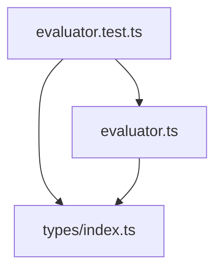

# 設計書: ハンド評価テスト

## 概要

**目的**: `evaluateHand` 関数の役判定ロジックの正しさを、全役パターンで網羅的に数値検証する単体テストを提供する。

**ユーザー**: 開発者が `evaluator.ts` のロジック変更時にリグレッションを即座に検出できる。

**影響**: 既存コードへの変更なし。新規テストファイルの追加のみ。

### ゴール
- 全10役の `rank` 値と `rankName` 文字列の正確性を検証する
- スコアの大小関係（役の強さ順）を検証する
- 同役キッカー比較、ホイールストレート、7枚入力、0枚入力のエッジケースを検証する

### ノンゴール
- `evaluator.ts` のロジック修正やリファクタリング
- パフォーマンステスト
- 他のユーティリティ（`deck.ts`、`gameLogic.ts`）のテスト

---

## アーキテクチャ

### 既存アーキテクチャ分析

- **テスト基盤**: Vitest `^4.1.1`、`vitest.config.ts`（`globals: true`）、`src/test/setup.ts`
- **既存テストパターン**: `src/utils/__tests__/deck.test.ts` が規約を確立
- **テスト対象**: `src/utils/evaluator.ts` — `evaluateHand`、`HandRank` をエクスポート
- **技術的制約**: なし（テスト追加のみ）

### アーキテクチャパターン & 境界マップ



**アーキテクチャ統合**:
- 選択パターン: 既存テストディレクトリへの新規ファイル追加
- 既存パターンの保持: `__tests__/` ディレクトリ配置、日本語テスト名、`describe`/`test` 構造
- 新規コンポーネントの理由: テストカバレッジの欠如を埋める
- ステアリング準拠: `structure.md` のテスト配置パターンに従う

### テクノロジースタック

| レイヤー | 選択 / バージョン | 本フィーチャーでの役割 | 備考 |
|---------|------------------|----------------------|------|
| テスト | Vitest ^4.1.1 | テストランナー・アサーション | 構築済み |

---

## 要件トレーサビリティ

| 要件 | サマリー | コンポーネント | インターフェース | フロー |
|------|---------|--------------|----------------|-------|
| 1.1〜1.10 | 各役のrank値検証 | evaluator.test.ts | evaluateHand | — |
| 2.1〜2.10 | 各役のrankName検証 | evaluator.test.ts | evaluateHand | — |
| 3.1 | スコア大小関係 | evaluator.test.ts | evaluateHand | — |
| 4.1 | 同役キッカー比較 | evaluator.test.ts | evaluateHand | — |
| 5.1〜5.2 | ホイールストレート | evaluator.test.ts | evaluateHand | — |
| 6.1 | 7枚入力bestCards | evaluator.test.ts | evaluateHand | — |
| 7.1〜7.3 | 0枚入力エッジケース | evaluator.test.ts | evaluateHand | — |

---

## コンポーネントとインターフェース

| コンポーネント | ドメイン/レイヤー | 意図 | 要件カバレッジ | 主要依存 | コントラクト |
|--------------|-----------------|------|-------------|---------|------------|
| evaluator.test.ts | テスト | evaluateHandの全役検証 | 1〜7 | evaluator.ts (P0), types (P0) | — |
| card ヘルパー | テスト内ユーティリティ | テストカード生成の簡略化 | 全要件で使用 | types (P0) | — |

### テストレイヤー

#### evaluator.test.ts

| フィールド | 詳細 |
|-----------|------|
| 意図 | `evaluateHand` 関数の全役パターン・エッジケースの数値検証 |
| 要件 | 1.1〜1.10, 2.1〜2.10, 3.1, 4.1, 5.1〜5.2, 6.1, 7.1〜7.3 |

**責務と制約**
- `evaluateHand` の戻り値（`rank`、`rankName`、`score`、`bestCards`）を数値・文字列で検証する
- テスト対象の内部実装には依存しない（パブリックAPIのみ使用）
- 既存の `deck.test.ts` のスタイルに準拠する

**依存関係**
- Inbound: なし
- Outbound: `evaluator.ts` — `evaluateHand`、`HandRank` (P0)
- Outbound: `types/index.ts` — `PlayingCard`、`Suit`、`Rank` 型 (P0)

**コントラクト**: なし（テストファイルは外部コントラクトを持たない）

**テスト構造設計**

テストファイルは以下の `describe` ブロックで構成する:

```typescript
// テストファイル内ヘルパー
const card = (suit: Suit, rank: Rank): PlayingCard => ({ suit, rank })
```

| describe ブロック | テスト内容 | 対応要件 |
|-----------------|----------|---------|
| `'各役のrank値'` | 全10役の `.rank` 数値検証 | 1.1〜1.10 |
| `'各役のrankName'` | 全10役の `.rankName` 文字列検証 | 2.1〜2.10 |
| `'スコアの大小関係'` | 隣接する役のスコア比較チェーン | 3.1 |
| `'同役キッカー比較'` | ワンペアA+キッカーK vs Q | 4.1 |
| `'ホイールストレート'` | A-2-3-4-5 の rank 値とスコア比較 | 5.1〜5.2 |
| `'7枚入力'` | bestCards.length = 5 | 6.1 |
| `'0枚入力'` | rank = 1, rankName = 'None', score = 0 | 7.1〜7.3 |

**テストデータ設計**

各役のテストに使用するカードの具体的な組み合わせ:

| 役 | ホールカード | コミュニティカード | 期待値 |
|---|------------|------------------|--------|
| ロイヤルフラッシュ | hearts A, hearts K | hearts Q, hearts J, hearts 10 | rank=10, rankName='Royal Flush' |
| ストレートフラッシュ | spades 9, spades 8 | spades 7, spades 6, spades 5 | rank=9, rankName='Straight Flush' |
| フォーカード | hearts A, diamonds A | clubs A, spades A, hearts K | rank=8, rankName='Four of a Kind' |
| フルハウス | hearts K, diamonds K | clubs K, spades Q, hearts Q | rank=7, rankName='Full House' |
| フラッシュ | hearts A, hearts J | hearts 8, hearts 5, hearts 3 | rank=6, rankName='Flush' |
| ストレート | hearts 10, diamonds 9 | clubs 8, spades 7, hearts 6 | rank=5, rankName='Straight' |
| スリーカード | hearts Q, diamonds Q | clubs Q, spades 7, hearts 3 | rank=4, rankName='Three of a Kind' |
| ツーペア | hearts J, diamonds J | clubs 8, spades 8, hearts 3 | rank=3, rankName='Two Pair' |
| ワンペア | hearts 10, diamonds 10 | clubs 7, spades 5, hearts 2 | rank=2, rankName='One Pair' |
| ハイカード | hearts A, diamonds 9 | clubs 6, spades 4, hearts 2 | rank=1, rankName='High Card' |

**キッカー比較用テストデータ**:

| ケース | ホールカード | コミュニティカード |
|-------|------------|------------------|
| ペアA + キッカーK | hearts A, diamonds K | clubs A, spades 7, hearts 3 |
| ペアA + キッカーQ | hearts A, diamonds Q | clubs A, spades 7, hearts 3 |

**ホイールストレート用テストデータ**:

| ケース | ホールカード | コミュニティカード |
|-------|------------|------------------|
| ホイール（A-2-3-4-5） | hearts A, diamonds 2 | clubs 3, spades 4, hearts 5 |
| 通常ストレート（2-3-4-5-6） | hearts 2, diamonds 3 | clubs 4, spades 5, hearts 6 |

**7枚入力用テストデータ**:

| ケース | ホールカード | コミュニティカード |
|-------|------------|------------------|
| 7枚入力 | hearts A, diamonds K | clubs Q, spades J, hearts 10, diamonds 5, clubs 3 |

**実装ノート**
- `card` ヘルパーはテストファイル内のトップレベルに定義する（外部ファイルに切り出さない）
- 各 `describe` ブロックは独立しており、テスト間の依存はない
- `evaluateHand` は純粋関数のため、テストの実行順序に依存しない

---

## テスト戦略

### 単体テスト
本フィーチャー自体がテストの作成であるため、テスト戦略は要件そのものと一致する:

1. 全10役の `rank` 値と `rankName` の検証（要件1, 2）
2. スコア大小チェーン（要件3）
3. キッカー比較（要件4）
4. ホイールストレート（要件5）
5. 7枚入力の bestCards 長（要件6）
6. 0枚入力のエッジケース（要件7）

### チェックポイント
- `npm run test` — 全単体テストパス
- `npm run test:e2e` — 全E2Eテストパス（スクリーンショット差分 0）
