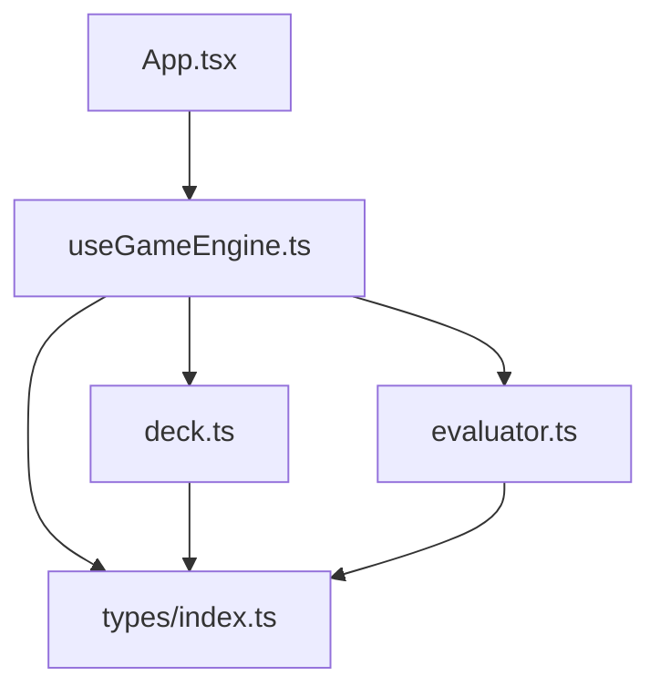
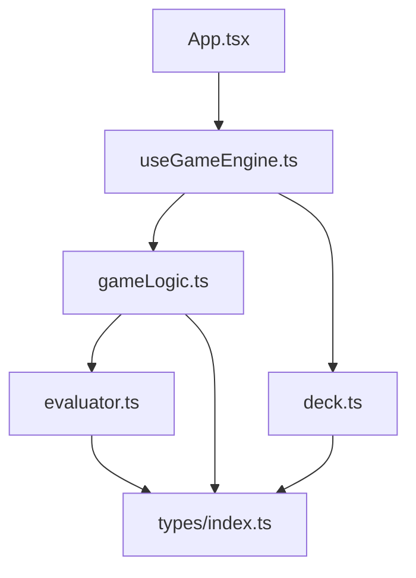

# 設計書: ゲームロジック抽出 + テスト

## Overview

**Purpose**: `useGameEngine`フック内に集約されているゲームロジックを純粋関数として`src/utils/gameLogic.ts`に抽出し、単体テスト可能にする。

**Users**: 開発者が各ゲームロジック関数を独立して検証・保守できるようにする。

**Impact**: `useGameEngine.ts`のロジック部分を`gameLogic.ts`に移動。外部振る舞いは変更しない。

### Goals
- 5つのゲームロジック関数を純粋関数として抽出
- 抽出した関数の単体テストを作成
- リファクタリング後のUIとゲームフロー維持を保証

### Non-Goals
- ゲームロジックのバグ修正（フェーズ4以降で対応）
- useGameEngineのアーキテクチャ変更（Reducerパターン化等）
- CPU AI ロジックの抽出
- パフォーマンス最適化

## Architecture

### 既存アーキテクチャ分析

現在のゲームロジックは`useGameEngine.ts`（331行）に集約されている。ユーティリティ関数は`src/utils/`に純粋関数として配置するパターンが確立済み（`deck.ts`, `evaluator.ts`）。



### Architecture Pattern & Boundary Map

リファクタリング後のアーキテクチャ:



- **選択パターン**: 純粋関数抽出（既存の`deck.ts`/`evaluator.ts`パターンに準拠）
- **境界**: `gameLogic.ts`は純粋関数のみ。副作用（`setTimeout`, `setState`）は`useGameEngine.ts`に残す
- **既存パターン維持**: `src/utils/`へのユーティリティ配置、`import type`の使用、相対パスインポート

### Technology Stack

| レイヤー | 選択 / バージョン | 役割 | 備考 |
|---------|------------------|------|------|
| テストフレームワーク | Vitest（既存） | 単体テスト | 構築済み |
| E2Eテスト | Playwright（既存） | 回帰テスト | 構築済み |

新規依存の追加なし。

## Requirements Traceability

| 要件 | サマリー | コンポーネント | インターフェース | フロー |
|------|---------|---------------|-----------------|-------|
| 1.1-1.5 | getNextActivePlayer抽出 | gameLogic.ts | getNextActivePlayer() | - |
| 2.1-2.7 | isRoundOver抽出 | gameLogic.ts | isRoundOver() | - |
| 3.1-3.5 | calculateBlinds抽出 | gameLogic.ts | calculateBlinds() | - |
| 4.1-4.6 | applyAction抽出 | gameLogic.ts | applyAction() | - |
| 5.1-5.3 | determineWinner抽出 | gameLogic.ts | determineWinner() | - |
| 6.1-6.3 | useGameEngine振る舞い維持 | useGameEngine.ts | 既存APIを維持 | - |
| 7.1-7.8 | 単体テスト | gameLogic.test.ts | - | - |
| 8.1-8.2 | 既存テスト維持 | - | - | - |

## Components and Interfaces

| コンポーネント | ドメイン/レイヤー | 意図 | 要件カバレッジ | 主要依存 | コントラクト |
|--------------|------------------|------|--------------|---------|-------------|
| gameLogic.ts | Utils | ゲームロジック純粋関数 | 1-5, 7 | evaluator.ts (P1), types (P0) | Service |
| useGameEngine.ts | Hooks | ゲーム状態管理（変更） | 6 | gameLogic.ts (P0), deck.ts (P0) | State |
| gameLogic.test.ts | Tests | 単体テスト | 7 | gameLogic.ts (P0) | - |

### Utils レイヤー

#### gameLogic.ts

| フィールド | 詳細 |
|-----------|------|
| Intent | ゲームロジックの純粋関数群を提供 |
| Requirements | 1.1-1.5, 2.1-2.7, 3.1-3.5, 4.1-4.6, 5.1-5.3 |

**責務 & 制約**
- 5つのゲームロジック関数を純粋関数としてエクスポート
- 副作用（`setTimeout`, `setState`, DOM操作）を含まない
- `GameState`型、`GamePhase`型、ゲーム定数のエクスポート

**依存**
- Inbound: `useGameEngine.ts` — ゲーム状態管理から呼び出し (P0)
- Outbound: `evaluator.ts` — ハンド評価 (P1)
- Outbound: `types/index.ts` — `Player`, `PlayingCard`型 (P0)

**Contracts**: Service [x]

##### Service Interface

```typescript
import type { Player, PlayingCard } from '../types';

// --- 型定義（useGameEngine.tsから移動）---

type GamePhase = 'idle' | 'pre-flop' | 'flop' | 'turn' | 'river' | 'showdown' | 'game-over';

interface GameState {
  players: Player[];
  communityCards: PlayingCard[];
  deck: PlayingCard[];
  pot: number;
  currentBet: number;
  phase: GamePhase;
  activePlayerIndex: number;
  dealerIndex: number;
  logs: string[];
}

// --- 定数（useGameEngine.tsから移動）---

const INITIAL_CHIPS: number;  // 1000
const SMALL_BLIND: number;    // 10
const BIG_BLIND: number;      // 20

// --- ブラインド計算の戻り値 ---

interface BlindPositions {
  dealer: number;
  sb: number;
  bb: number;
  utg: number;
}

// --- applyActionの戻り値 ---

interface ApplyActionResult {
  players: Player[];
  pot: number;
  currentBet: number;
  log: string;
}

// --- determineWinnerの戻り値 ---

interface WinnerResult {
  winnerId: string;
  winnerName: string;
  handRankName: string;
}

// --- 関数シグネチャ ---

function getNextActivePlayer(
  currentIndex: number,
  players: Player[]
): number;

function isRoundOver(
  players: Player[],
  currentBet: number
): boolean;

function calculateBlinds(
  players: Player[],
  dealerIndex: number
): BlindPositions;

function applyAction(
  players: Player[],
  playerIndex: number,
  action: 'fold' | 'call' | 'raise',
  amount: number,
  pot: number,
  currentBet: number
): ApplyActionResult;

function determineWinner(
  players: Player[],
  communityCards: PlayingCard[]
): WinnerResult;
```

- 前提条件: 各関数に渡される`players`配列は有効なプレイヤーデータを含む
- 事後条件: 入力データを変更しない（新しいオブジェクトを返す）
- 不変条件: 全関数は純粋関数であり、副作用を持たない

**Implementation Notes**
- `getNextActivePlayer`: `useGameEngine.ts` L138-144のロジックをそのまま移動。`% 5`を`% players.length`に変更
- `isRoundOver`: `useGameEngine.ts` L146-158のロジックをそのまま移動
- `calculateBlinds`: `startNextHand` L88-100のインラインロジックを関数化。`dealerIndex`は前回のディーラーインデックスを受け取り、次のディーラーから計算する。`dealerIndex`が`-1`（初回）の場合は、インデックス0から次のアクティブプレイヤーをディーラーとして計算を開始する
- `applyAction`: `handleAction` L200-271の純粋計算部分のみ抽出。副作用（`setTimeout`、`startNextHand`呼び出し、`advancePhase`呼び出し）は`useGameEngine.ts`に残す
- `determineWinner`: `useEffect` L274-305のハンド評価・勝者判定ロジックを抽出。`evaluateHand`の呼び出しを含む

### Hooks レイヤー

#### useGameEngine.ts（変更）

| フィールド | 詳細 |
|-----------|------|
| Intent | ゲーム状態管理とReact統合（リファクタリング） |
| Requirements | 6.1-6.3 |

**責務 & 制約**
- `gameLogic.ts`からインポートした関数を使用してゲーム状態を管理
- React状態管理（`useState`, `useEffect`, `useCallback`）と副作用の管理
- 外部APIインターフェース（`state`, `startGame`, `handleAction`）を維持

**依存**
- Inbound: `App.tsx` — ゲーム状態とアクション (P0)
- Outbound: `gameLogic.ts` — ゲームロジック関数群 (P0)
- Outbound: `deck.ts` — デッキ生成 (P0)

**Contracts**: State [x]

##### State Management
- 状態モデル: `GameState`（`gameLogic.ts`からインポート）
- 永続化: なし（メモリ内のみ）
- 並行性: React状態更新のバッチング

**Implementation Notes**
- `GameState`, `GamePhase`型は`gameLogic.ts`からre-export
- `getNextActivePlayer`, `isRoundOver`, `calculateBlinds`, `applyAction`, `determineWinner`を`gameLogic.ts`からインポートして使用
- `startNextHand`内のブラインド計算を`calculateBlinds`呼び出しに置換
- `handleAction`内の純粋計算を`applyAction`呼び出しに置換
- ショーダウンの`useEffect`内の勝者判定を`determineWinner`呼び出しに置換

## Data Models

### Domain Model

既存の型定義を変更しない。`gameLogic.ts`で新規に定義する型:

- **`BlindPositions`**: dealer, sb, bb, utgのインデックスを保持するValue Object
- **`ApplyActionResult`**: アクション適用結果（更新後のplayers, pot, currentBet, log）を保持するValue Object
- **`WinnerResult`**: 勝者判定結果（winnerId, winnerName, handRankName）を保持するValue Object

既存型（`Player`, `PlayingCard`, `PlayerAction`）は`src/types/index.ts`に維持。

## Error Handling

全関数は純粋関数であり、例外をスローしない。入力値の範囲内で結果を返す。不正な入力（存在しないインデックス等）に対する防御的処理は、呼び出し元の`useGameEngine.ts`が既存の振る舞いを維持する形で担保する。

## Testing Strategy

### 単体テスト（Vitest）

テストファイル: `src/utils/__tests__/gameLogic.test.ts`

| テスト対象 | テストケース |
|-----------|------------|
| `getNextActivePlayer` | 次のアクティブプレイヤーのインデックスを返す |
| `getNextActivePlayer` | フォールド済みプレイヤーをスキップする |
| `getNextActivePlayer` | チップ0のプレイヤーをスキップする |
| `isRoundOver` | 全員行動済み・ベット一致で`true`を返す |
| `isRoundOver` | 未行動者がいれば`false`を返す |
| `isRoundOver` | ベット不一致で`false`を返す |
| `isRoundOver` | アクティブ1人で`true`を返す |
| `calculateBlinds` | dealer, sb, bb, utgの正しいインデックスを返す |
| `calculateBlinds` | 非アクティブプレイヤーをスキップする |
| `calculateBlinds` | `dealerIndex`が`-1`（初回）の場合にインデックス0から計算する |
| `applyAction` (fold) | `player.action`が`'fold'`になる |
| `applyAction` (call) | `player.chips`が減少し`pot`が増加する |
| `applyAction` (raise) | `player.currentBet`が`currentBet * 2`以上になる |
| `determineWinner` | 最強ハンドのプレイヤーIDを返す |

### 回帰テスト

| テストスイート | 検証内容 |
|--------------|---------|
| `npm run test` | 既存単体テスト（deck, evaluator）+ 新規テスト（gameLogic）全パス |
| `npm run test:e2e` | Playwright E2Eテスト全パス、スクリーンショット差分0 |
