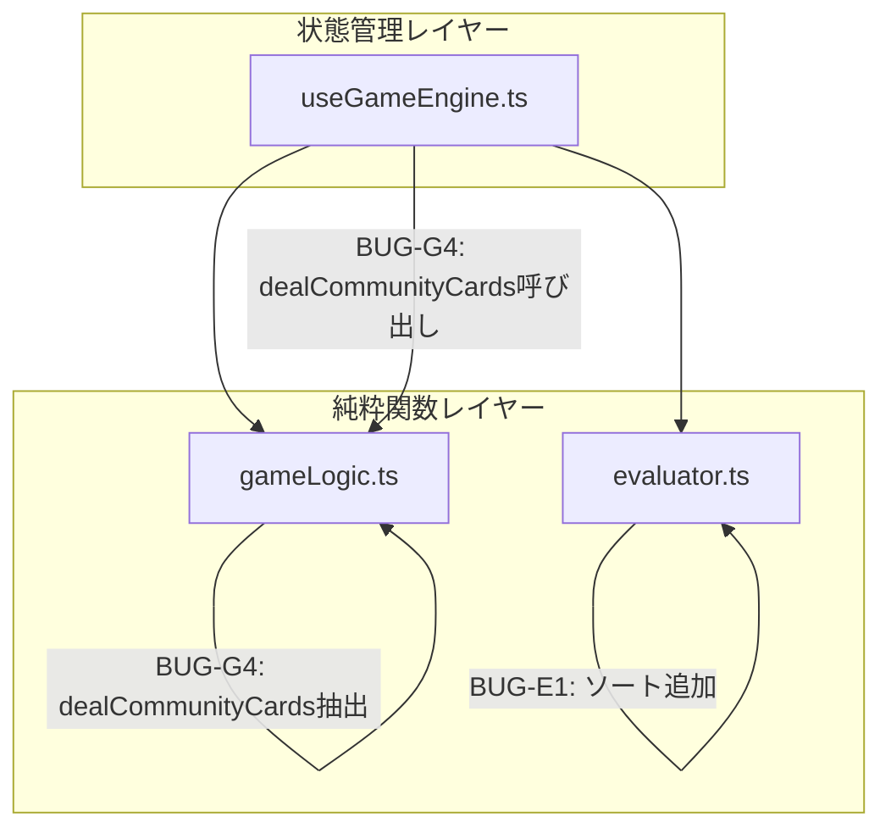

# 設計書: logic-bug-fixes

## 概要

**目的**: UIに影響しない4件のロジックバグ（BUG-G7, BUG-E1, BUG-G5, BUG-G4）を修正し、ゲームロジックの正確性と堅牢性を向上させる。

**ユーザー**: テキサスホールデムをプレイするすべてのプレイヤーが、正確なルールとバグのないゲーム進行の恩恵を受ける。

**影響**: `gameLogic.ts`、`evaluator.ts`、`useGameEngine.ts`のロジック修正。UIへの変更なし。

### ゴール
- Raise金額が負値にならないことを保証する (BUG-G7)
- ストレート検出が入力順序に依存しないことを保証する (BUG-E1)
- `getNextActivePlayer`が無限ループしないことを保証する (BUG-G5)
- テキサスホールデムのルールに従いバーンカードを実装する (BUG-G4)

### 非ゴール
- UIの変更やスクリーンショットベースラインの更新
- サイドポット実装（BUG-G1）やその他の高重大度バグ修正
- CPU AIの改善
- パフォーマンス最適化

## アーキテクチャ

### 既存アーキテクチャ分析

現在のゲームロジックはレイヤー分離型アーキテクチャに従い、以下の構造を持つ:

- **純粋関数レイヤー** (`src/utils/gameLogic.ts`, `src/utils/evaluator.ts`): 状態を持たないゲームロジック
- **状態管理レイヤー** (`src/hooks/useGameEngine.ts`): Reactフック内でのゲーム状態管理とフェーズ遷移
- **UIレイヤー** (`src/components/`): 表示責務のみ

フェーズ3で`getNextActivePlayer`, `isRoundOver`, `calculateBlinds`, `applyAction`, `determineWinner`を`gameLogic.ts`に抽出済み。本設計はこのパターンを踏襲する。

### アーキテクチャパターン & バウンダリマップ



**アーキテクチャ統合**:
- 選択パターン: 既存の純粋関数抽出パターンの踏襲
- ドメイン境界: 純粋関数レイヤーと状態管理レイヤーの分離を維持
- 既存パターンの保持: フェーズ3で確立した`gameLogic.ts`への抽出パターン
- 新コンポーネントの理由: `dealCommunityCards`関数を`gameLogic.ts`に追加（テスト可能性のため）

### 技術スタック

| レイヤー | 選択/バージョン | 機能での役割 | 備考 |
|---------|---------------|-------------|------|
| フロントエンド | React 19 + TypeScript | 状態管理フック | 既存。変更は`useGameEngine.ts`のみ |
| テスト | Vitest | 単体テスト | 既存。新テストケース追加 |
| E2Eテスト | Playwright | リグレッション検証 | 既存。スクリーンショット差分0を確認 |

## 要件トレーサビリティ

| 要件 | 概要 | コンポーネント | インターフェース | フロー |
|------|------|--------------|----------------|--------|
| 1.1, 1.2, 1.3 | Raise金額の負値防止 | `applyAction` | `ApplyActionResult` | Raise処理フロー |
| 2.1, 2.2, 2.3 | ストレート検出の明示的ソート | `evaluateHand`内`findStraight` | `HandResult` | ハンド評価フロー |
| 3.1, 3.2, 3.3 | getNextActivePlayerの無限ループ防止 | `getNextActivePlayer` | 戻り値`number` | プレイヤー遷移フロー |
| 4.1, 4.2, 4.3, 4.4 | バーンカードの実装 | `dealCommunityCards`（新規）、`advancePhase` | `DealCommunityCardsResult` | フェーズ遷移フロー |

## コンポーネントとインターフェース

| コンポーネント | ドメイン/レイヤー | 意図 | 要件カバレッジ | 主要依存関係 | コントラクト |
|--------------|-----------------|------|--------------|-------------|-------------|
| `applyAction` | 純粋関数 | Raise金額のガード追加 | 1.1, 1.2, 1.3 | なし | Service |
| `findStraight` | 純粋関数 | ソート追加 | 2.1, 2.2, 2.3 | なし | — |
| `getNextActivePlayer` | 純粋関数 | ループ上限追加 | 3.1, 3.2, 3.3 | なし | Service |
| `dealCommunityCards` | 純粋関数（新規） | バーンカード付きカード配布 | 4.1, 4.2, 4.3, 4.4 | なし | Service |
| `advancePhase` | 状態管理 | `dealCommunityCards`呼び出しに変更 | 4.1, 4.2, 4.3, 4.4 | `dealCommunityCards` (P0) | State |

### 純粋関数レイヤー

#### `applyAction` — Raise金額ガード追加

| フィールド | 詳細 |
|-----------|------|
| 意図 | Raise処理で`raiseAmount`が負値にならないことを保証する |
| 要件 | 1.1, 1.2, 1.3 |

**責務と制約**
- `raiseAmount`の計算結果に`Math.max(0, ...)`ガードを追加
- 既存の計算ロジック構造は維持
- チップの減少のみを許可し、増加を防止

**依存関係**
- なし（既存の純粋関数内の修正）

**コントラクト**: Service [x]

##### サービスインターフェース

```typescript
// 既存インターフェース — 変更なし
export const applyAction: (
  players: Player[],
  playerIndex: number,
  action: 'fold' | 'call' | 'raise',
  amount: number,
  pot: number,
  currentBet: number,
) => ApplyActionResult;
```

- 事前条件: `playerIndex`が有効なインデックスであること
- 事後条件: Raise時、`raiseAmount >= 0` であること。プレイヤーのチップは減少のみ（増加しない）
- 不変条件: `updatedPlayers[playerIndex].chips >= 0`

**実装ノート**
- 変更箇所: `raiseAmount`の計算式に`Math.max(0, ...)`を追加
- 検証: `totalToPutIn < currentBet`のケースで`raiseAmount >= 0`をテストで確認

---

#### `findStraight` — 明示的ソート追加

| フィールド | 詳細 |
|-----------|------|
| 意図 | ストレート検出を入力カードの順序に依存させない |
| 要件 | 2.1, 2.2, 2.3 |

**責務と制約**
- `uniqueVals`配列を降順にソートしてからストレート判定を実行
- `evaluateHand`内のクロージャであり、外部インターフェースは変更なし

**依存関係**
- なし（`evaluateHand`内のクロージャ修正）

**コントラクト**: なし（内部クロージャのため外部コントラクトなし）

**実装ノート**
- 変更箇所: `const uniqueVals = [...new Set(...)]`の直後に`.sort((a, b) => b - a)`を追加
- 検証: ソートされていないカード配列でストレートが正しく検出されることをテストで確認

---

#### `getNextActivePlayer` — ループ上限追加

| フィールド | 詳細 |
|-----------|------|
| 意図 | 全プレイヤーが非アクティブの場合に無限ループを防止する |
| 要件 | 3.1, 3.2, 3.3 |

**責務と制約**
- ループ回数がプレイヤー数を超えた場合にループを終了
- 全員が非アクティブの場合に-1を返す
- 正常ケースでは従来通りの動作を維持

**依存関係**
- Inbound: `useGameEngine.ts` `advancePhase` — firstToAct計算 (P0)
- Inbound: `useGameEngine.ts` `handleAction` — 次プレイヤー決定 (P0)

**コントラクト**: Service [x]

##### サービスインターフェース

```typescript
// 戻り値の意味が拡張される（-1が追加）
export const getNextActivePlayer: (
  currentIndex: number,
  players: Player[],
) => number; // -1: アクティブなプレイヤーが存在しない
```

- 事前条件: `players.length > 0`
- 事後条件: 戻り値はアクティブプレイヤーのインデックス、または-1（全員非アクティブ）
- 不変条件: ループ回数は`players.length`以下

**実装ノート**
- 変更箇所: whileループにカウンタを追加。カウンタが`players.length`に達したら-1を返す

**呼び出し元への影響分析**

-1返却は既存のゲームフローにおいて安全である。以下に呼び出し元ごとの分析を示す:

| 呼び出し元 | 使用箇所 | -1返却時の影響 |
|-----------|---------|--------------|
| `advancePhase` (`useGameEngine.ts` L141) | `firstToAct`計算 | showdownフェーズでは`activePlayerIndex: -1`が設定される既存の挙動と整合する。showdown以外のフェーズでは全員フォールド状態に到達する前に`isRoundOver`でラウンド終了が検出されるため、-1が`firstToAct`に設定されることはない |
| `handleAction` (`useGameEngine.ts` L189) | `nextActive`計算 | ここに到達する前に`isRoundOver`チェックで全員フォールドが検出され、ラウンド終了処理に分岐する。そのため-1が`nextActive`に設定されるパスは通常のゲームフローでは到達しない |

結論: -1返却に対する呼び出し元での追加ガードは不要

---

#### `dealCommunityCards` — 新規関数

| フィールド | 詳細 |
|-----------|------|
| 意図 | フェーズ遷移時のコミュニティカード配布をバーンカード付きで実行する |
| 要件 | 4.1, 4.2, 4.3, 4.4 |

**責務と制約**
- 現在のフェーズに応じてバーンカード1枚を破棄した後、コミュニティカードを配布
- デッキの変異を避けるため、新しいデッキ配列を返す
- フロップ: バーン1枚 + 配布3枚 = デッキから4枚消費
- ターン: バーン1枚 + 配布1枚 = デッキから2枚消費
- リバー: バーン1枚 + 配布1枚 = デッキから2枚消費

**依存関係**
- Inbound: `useGameEngine.ts` `advancePhase` — カード配布 (P0)

**コントラクト**: Service [x]

##### サービスインターフェース

```typescript
export interface DealCommunityCardsResult {
  newCommunityCards: PlayingCard[];
  newDeck: PlayingCard[];
}

export const dealCommunityCards: (
  phase: GamePhase,
  communityCards: PlayingCard[],
  deck: PlayingCard[],
) => DealCommunityCardsResult;
```

- 事前条件: `deck.length`がバーン+配布に必要な枚数以上であること
- 事後条件:
  - フロップ: `newCommunityCards.length === communityCards.length + 3`、`newDeck.length === deck.length - 4`
  - ターン: `newCommunityCards.length === communityCards.length + 1`、`newDeck.length === deck.length - 2`
  - リバー: `newCommunityCards.length === communityCards.length + 1`、`newDeck.length === deck.length - 2`
  - river→showdown: カード変更なし
- 不変条件: 元の`communityCards`と`deck`は変更されない

**実装ノート**
- `advancePhase`内のカード配布ロジック（L122-131相当）を本関数に移動
- `advancePhase`は本関数を呼び出すように変更

---

### 状態管理レイヤー

#### `advancePhase` — `dealCommunityCards`呼び出しに変更

| フィールド | 詳細 |
|-----------|------|
| 意図 | フェーズ遷移時にカード配布ロジックを`dealCommunityCards`に委譲する |
| 要件 | 4.1, 4.2, 4.3, 4.4 |

**責務と制約**
- カード配布ロジックを`dealCommunityCards`関数呼び出しに置き換え
- フェーズ遷移、プレイヤーリセット、firstToAct計算の責務は維持

**依存関係**
- Outbound: `dealCommunityCards` — カード配布 (P0)
- Outbound: `getNextActivePlayer` — firstToAct計算 (P0)

**コントラクト**: State [x]

##### 状態管理

- 状態モデル: `GameState`（変更なし）
- 変更点: `advancePhase`内のカード配布コードを`dealCommunityCards`呼び出しに置換

## エラーハンドリング

### エラー戦略

本機能は純粋関数のバグ修正が主であり、新たなエラーカテゴリは`getNextActivePlayer`の-1返却のみ。

### エラーケースと対応

| コンポーネント | エラーケース | 対応 |
|--------------|------------|------|
| `applyAction` | `raiseAmount`が負値になるケース | `Math.max(0, ...)`ガードにより0に正規化。例外は発生しない |
| `getNextActivePlayer` | 全プレイヤーが非アクティブ | -1を返す。呼び出し元への影響の詳細は`getNextActivePlayer`コンポーネント節の呼び出し元影響分析を参照 |
| `dealCommunityCards` | デッキ枚数不足 | 52枚デッキで最大消費18枚（ホール10 + バーン3 + コミュニティ5）のため、通常のゲーム進行では発生しない。万が一デッキ枚数が不足した場合、`deck.pop()`が`undefined`を返しコミュニティカードに`undefined`が混入する。本修正ではこの異常系のガードは追加しない（正常なゲーム進行を前提とし、デッキ管理の堅牢化は本スコープ外） |

## テスト戦略

### 単体テスト

1. **BUG-G7 `applyAction` Raiseガード**: `totalToPutIn < currentBet`のケースで`raiseAmount >= 0`を検証。チップが増加しないことを検証
2. **BUG-E1 `evaluateHand` ストレートソート**: ソートされていないカード配列を入力し、ストレートが正しく検出されることを検証。フラッシュカードサブセットでのストレートフラッシュ検出を検証
3. **BUG-G5 `getNextActivePlayer` ループ上限**: 全員フォールド/チップ0の状態で-1を返すことを検証。正常ケースでの動作が変わらないことを検証
4. **BUG-G4 `dealCommunityCards` バーンカード**: 各フェーズでデッキ残枚数が期待値と一致することを検証（フロップ: -4、ターン: -2、リバー: -2）。コミュニティカード枚数が正しいことを検証

### E2Eテスト

1. **リグレッション確認**: 既存のPlaywright E2Eテスト全パス + スクリーンショット差分0を確認
