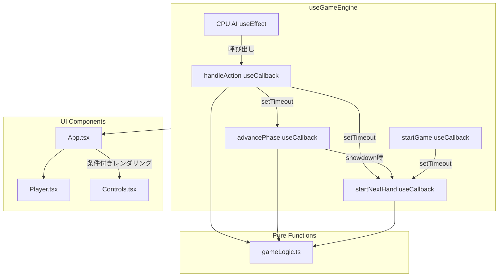
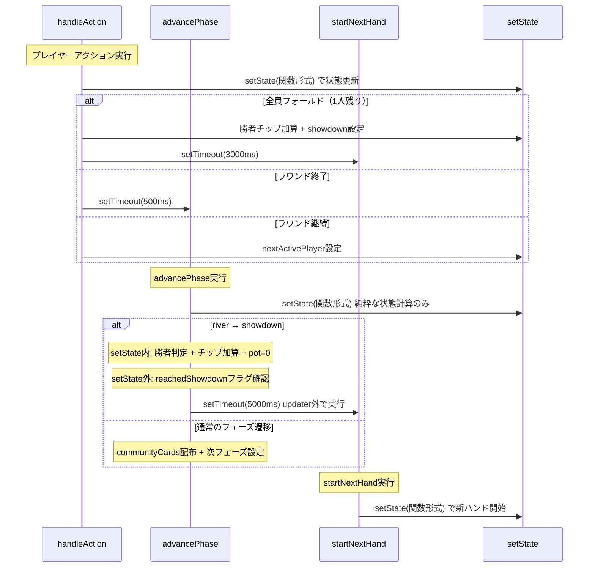

# 設計書: ロジック・UIバグ修正（フェーズ5）

## 概要

**目的**: テキサスホールデム・ポーカーゲームのUIの振る舞いに影響する5件のバグ（BUG-G2, BUG-G6, BUG-G3, BUG-U1, BUG-U2）を修正する。
**ユーザー**: プレイヤー（正しいカード表示・Controls表示）および開発者（安定したReactパターン）が恩恵を受ける。
**影響**: `useGameEngine`フックのフェーズ遷移パターン変更、`Player.tsx`のカード表示条件修正、`App.tsx`のControls条件付きレンダリング追加。

### ゴール

- ネストされた`setState`呼び出しを解消し、Reactの推奨パターンに準拠する
- ショーダウン処理の`useEffect`を排除し、StrictMode二重実行リスクを根本的に解消する
- `handleAction`の`useCallback`依存配列を適切に設定する
- オールインプレイヤーのカードをショーダウンまで裏面表示にする
- ショーダウン/ゲームオーバー時にControlsを非表示にする

### 非ゴール

- ゲームロジックの新機能追加（サイドポット等はフェーズ6で対応）
- CPU AIロジックの改善
- パフォーマンス最適化
- CPU AI用`useEffect`（タイマー管理）の排除

---

## アーキテクチャ

### 既存アーキテクチャ分析

**現在のパターンと制約:**
- `useGameEngine`フックが全ゲーム状態を`useState`で管理
- フェーズ遷移は`setTimeout` + `setState`の組み合わせで遅延実行
- 純粋関数は`src/utils/gameLogic.ts`に抽出済み
- ショーダウン処理が`useEffect`に依存（BUG-G6の原因）

**維持すべき統合ポイント:**
- `gameLogic.ts`の純粋関数群（`dealCommunityCards`, `determineWinner`, `getNextActivePlayer`等）
- `data-testid`属性によるE2Eテスト基盤
- CPU AI用`useEffect`（`state.activePlayerIndex`監視）

**対処する技術的負債:**
- ネストされた`setState`（BUG-G2）
- ショーダウン`useEffect`のStrictMode脆弱性（BUG-G6）
- 空の`useCallback`依存配列（BUG-G3）

### アーキテクチャパターン & バウンダリマップ



**アーキテクチャ統合:**
- 選択パターン: setState関数形式（functional updater）統一 — 全てのstate更新関数で最新stateを保証
- ドメイン境界: ゲームロジック（gameLogic.ts純粋関数）とUI状態管理（useGameEngine）の分離を維持
- 既存パターン維持: `setTimeout`による遅延遷移、`data-testid`テストID
- 新規コンポーネント: なし（既存ファイルの修正のみ）

### テクノロジースタック

| レイヤー | 選択 / バージョン | フィーチャー内での役割 | 備考 |
|---------|------------------|---------------------|------|
| フロントエンド | React 19 | useState, useCallback, useEffect | 既存。useEffect使用を1箇所削減 |
| ビルド | Vite 8 | 開発サーバー・ビルド | 変更なし |
| テスト | Vitest + Playwright | 単体テスト + E2E | 既存テスト基盤を活用 |

---

## システムフロー

### フェーズ遷移フロー（BUG-G2 + BUG-G6修正後）



**キーポイント:**
- `advancePhase`は`setState`コールバック外から直接呼び出される（BUG-G2解消）
- ショーダウン処理は`advancePhase`内のsetState関数形式で状態計算し、副作用（setTimeout）はupdater外で実行（BUG-G6解消、useEffect不要、Concurrent Mode安全）
- 全関数がsetState関数形式を使用し、最新stateを保証

---

## 要件トレーサビリティ

| 要件 | 概要 | コンポーネント | インターフェース | フロー |
|------|------|--------------|-----------------|--------|
| 1.1 | advancePhaseをsetState外で呼び出し | useGameEngine: handleAction | handleAction, advancePhase | フェーズ遷移フロー |
| 1.2 | コミュニティカード枚数遷移 0→3→4→5 | useGameEngine: advancePhase | GameState | フェーズ遷移フロー |
| 1.3 | フェーズ名テキスト正常表示 | useGameEngine: advancePhase | GameState.phase | フェーズ遷移フロー |
| 1.4 | E2Eスクリーンショット合格 | E2Eテスト | — | — |
| 2.1 | 勝者チップ = 元値 + ポット | useGameEngine: advancePhase | GameState | フェーズ遷移フロー（showdown） |
| 2.2 | ショーダウン後ポット = $0 | useGameEngine: advancePhase | GameState.pot | フェーズ遷移フロー（showdown） |
| 2.3 | StrictModeでチップ加算1回 | useGameEngine: advancePhase | — | フェーズ遷移フロー（showdown） |
| 3.1 | 依存配列に適切な依存関係 | useGameEngine: handleAction | handleAction useCallback | — |
| 3.2 | 全テスト合格（回帰なし） | 全テスト | — | — |
| 3.3 | Fold/Call/Raise操作の正常表示 | E2Eテスト | — | — |
| 4.1 | オールイン時カード裏面表示 | Player.tsx | PlayerProps, Card faceUp | — |
| 4.2 | ショーダウン時カード表面表示 | Player.tsx | PlayerProps.revealCards | — |
| 4.3 | E2Eオールインカード裏面検証 | E2Eテスト | — | — |
| 4.4 | スクリーンショットベースライン更新 | E2Eテスト | — | — |
| 5.1 | ショーダウン時Controls非表示 | App.tsx | GameState.phase | — |
| 5.2 | ゲームオーバー時Controls非表示 | App.tsx | GameState.phase | — |
| 5.3 | E2Eボタン要素数0検証 | E2Eテスト | — | — |
| 5.4 | スクリーンショットベースライン更新 | E2Eテスト | — | — |
| 6.1 | 各修正後の単体テスト合格 | 全テスト | — | — |
| 6.2 | 各修正後のE2Eテスト合格 | 全テスト | — | — |
| 6.3 | スクリーンショットベースライン更新・差分0 | E2Eテスト | — | — |

---

## コンポーネントとインターフェース

### コンポーネントサマリー

| コンポーネント | ドメイン/レイヤー | 意図 | 要件カバレッジ | 主要依存（優先度） | コントラクト |
|--------------|-----------------|------|-------------|-------------------|------------|
| useGameEngine: advancePhase | ゲームロジック/Hooks | フェーズ遷移 + ショーダウン処理 | 1.1-1.4, 2.1-2.3 | gameLogic.ts (P0), setState (P0) | State |
| useGameEngine: handleAction | ゲームロジック/Hooks | プレイヤーアクション処理 | 1.1, 3.1-3.3 | advancePhase (P0), startNextHand (P0) | State |
| useGameEngine: startNextHand | ゲームロジック/Hooks | 新ハンド開始 | 2.1 | gameLogic.ts (P0), setState (P0) | State |
| Player.tsx | UI/Components | プレイヤー情報描画 | 4.1-4.4 | Card (P0) | — |
| App.tsx | UI/Components | メインUI + Controls表示制御 | 5.1-5.4 | Controls (P1), useGameEngine (P0) | — |

### ゲームロジック / Hooks

#### useGameEngine: advancePhase

| フィールド | 詳細 |
|-----------|------|
| 意図 | フェーズ遷移の実行。showdown到達時に勝者判定・チップ加算も担当 |
| 要件 | 1.1, 1.2, 1.3, 1.4, 2.1, 2.2, 2.3 |

**責務と制約**
- フェーズ遷移の計算（pre-flop→flop→turn→river→showdown）
- コミュニティカードの配布（`dealCommunityCards`純粋関数に委譲）
- showdown到達時: 勝者判定（`determineWinner`純粋関数に委譲）、チップ加算、ポット0化、次ハンドスケジューリング
- `setState`の関数形式を使用し、パラメータなしで最新stateを参照

**依存関係**
- Outbound: `dealCommunityCards` — コミュニティカード配布 (P0)
- Outbound: `determineWinner` — 勝者判定 (P0)
- Outbound: `getNextActivePlayer` — 次のアクティブプレイヤー取得 (P0)
- Outbound: `startNextHand` — 次ハンド開始スケジューリング (P0)

**コントラクト**: State [x]

##### State管理

**変更前のシグネチャ:**
```typescript
const advancePhase = (s: GameState) => void;
```

**変更後のシグネチャ:**
```typescript
const advancePhase = useCallback(() => {
  let reachedShowdown = false;
  setState((s: GameState): GameState => {
    // 純粋な状態計算のみ（副作用なし）
    // フェーズ遷移ロジック（既存）
    // showdown到達時: 勝者判定 + チップ加算 + pot=0 + reachedShowdownフラグ設定
    // 非showdown時: communityCards配布 + 次フェーズ設定
  });
  // setState updater外で副作用を実行（Concurrent Modeでの重複防止）
  if (reachedShowdown) {
    setTimeout(() => startNextHand(), 5000);
  }
}, [startNextHand]);
```

**showdown到達時のstate更新内容:**
```typescript
interface ShowdownStateUpdate {
  phase: 'showdown';
  pot: 0;
  activePlayerIndex: -1;
  players: Player[];  // 勝者のchipsにwinAmountを加算済み
  logs: string[];     // 勝者名・ハンドランク名を含むログ追加
}
```

**非showdown時のstate更新内容:**
```typescript
interface PhaseTransitionStateUpdate {
  phase: GamePhase;  // 次のフェーズ
  communityCards: PlayingCard[];  // 配布後のコミュニティカード
  deck: PlayingCard[];  // 配布後のデッキ
  players: Player[];  // currentBet=0にリセット、fold/all-inは維持
  currentBet: 0;
  activePlayerIndex: number;  // dealerの次のアクティブプレイヤー
}
```

**実装ノート**
- setState updaterは純粋関数として実装する。副作用（setTimeout）はupdater外で実行する。ローカル変数`reachedShowdown`をupdater内で設定し、updater外で条件分岐してsetTimeoutをスケジュールする。これによりConcurrent Modeでupdaterが複数回呼ばれてもタイマー重複が発生しない
- showdown処理は`useEffect`から完全に移動。ショーダウン`useEffect`（現在の193-217行）は削除
- `useCallback`の依存配列は`[startNextHand]`とする。`startNextHand`は`useCallback([], ...)`で安定しているため再生成は発生しない

---

#### useGameEngine: handleAction

| フィールド | 詳細 |
|-----------|------|
| 意図 | プレイヤーのアクション（fold/call/raise）を処理し、ゲーム状態を更新する |
| 要件 | 1.1, 3.1, 3.2, 3.3 |

**責務と制約**
- アクションの適用（`applyAction`純粋関数に委譲）
- ラウンド終了判定と次フェーズへの遷移トリガー
- 全員フォールド時の即座の勝者決定
- `setState`の関数形式を使用

**依存関係**
- Outbound: `applyAction` — アクション適用 (P0)
- Outbound: `isRoundOver` — ラウンド終了判定 (P0)
- Outbound: `getNextActivePlayer` — 次アクティブプレイヤー (P0)
- Outbound: `advancePhase` — フェーズ遷移トリガー (P0)
- Outbound: `startNextHand` — 全員フォールド時の次ハンド (P0)

**コントラクト**: State [x]

##### State管理

**変更前:**
```typescript
const handleAction = useCallback((action: 'fold'|'call'|'raise', amount: number = 0) => {
  setState(prev => {
    // ...
    if (isRoundOver(...)) {
      setTimeout(() => {
        setState(s => {
          advancePhase({...s, ...});  // ← ネストsetState（BUG-G2）
          return s;
        });
      }, 500);
    }
    // ...
  });
}, []);  // ← 空の依存配列（BUG-G3）
```

**変更後:**
```typescript
const handleAction = useCallback((action: 'fold'|'call'|'raise', amount: number = 0) => {
  setState(prev => {
    // ...
    if (isRoundOver(...)) {
      setTimeout(() => advancePhase(), 500);  // ← setState外から直接呼び出し
      return { ...prev, /* 中間状態 */ activePlayerIndex: -1 };
    }
    // ...
  });
}, [advancePhase, startNextHand]);  // ← 適切な依存配列
```

**キーポイント:**
- `setTimeout(() => advancePhase(), 500)` — `setState`コールバック内からsetTimeoutを登録するが、`advancePhase`自体は`setState`外で実行される
- `advancePhase`は`useCallback`でメモ化されており安定しているため、依存配列に含めても再生成は発生しない
- ラウンド終了時の中間状態更新で`activePlayerIndex: -1`を返す（UIがCPU行動を抑制するため）

---

#### useGameEngine: startNextHand

| フィールド | 詳細 |
|-----------|------|
| 意図 | 新しいハンドを開始する |
| 要件 | 2.1 |

**責務と制約**
- プレイヤーのリセット（cards, currentBet, action, role）
- アクティブプレイヤー数チェック（1人以下ならgame-over）
- デッキ生成・ブラインド計算・カード配布
- `setState`の関数形式を使用

**コントラクト**: State [x]

##### State管理

**変更前のシグネチャ:**
```typescript
const startNextHand = (currentPlayers: Player[], currentDealer: number) => void;
```

**変更後のシグネチャ:**
```typescript
const startNextHand = useCallback(() => {
  setState((s: GameState): GameState => {
    // s.players, s.dealerIndexから最新状態を取得
    // 新ハンドの状態を計算して返す
  });
}, []);
```

**実装ノート**
- パラメータを削除し、`setState`の関数形式で最新の`players`と`dealerIndex`を参照
- `startGame`からの呼び出しも、`setState`で初期状態をセットした後に`setTimeout(() => startNextHand(), 500)`で呼ぶため、最新stateが保証される

---

### UI / Components

#### Player.tsx

| フィールド | 詳細 |
|-----------|------|
| 意図 | オールインプレイヤーのカード表示条件を修正 |
| 要件 | 4.1, 4.2, 4.3, 4.4 |

**変更内容:**

Card コンポーネントの`faceUp`プロップの条件から`player.action === 'all-in'`を削除する。

**変更前:**
```typescript
faceUp={player.isHuman || player.action === 'all-in' || revealCards}
```

**変更後:**
```typescript
faceUp={player.isHuman || revealCards}
```

**実装ノート**
- `revealCards`プロップは`App.tsx`から`state.phase === 'showdown'`で渡されるため、ショーダウン時にはカードが表面表示される
- 変更量は1行のみ

---

#### App.tsx

| フィールド | 詳細 |
|-----------|------|
| 意図 | ショーダウン/ゲームオーバー時にControlsを非表示にする |
| 要件 | 5.1, 5.2, 5.3, 5.4 |

**変更内容:**

Controlsコンポーネントのレンダリングをフェーズベースの条件付きレンダリングに変更する。

**変更前:**
```typescript
<div className="absolute ...">
  <Controls isTurn={isTurn} ... />
</div>
```

**変更後:**
```typescript
{state.phase !== 'showdown' && state.phase !== 'game-over' && (
  <div className="absolute ...">
    <Controls isTurn={isTurn} ... />
  </div>
)}
```

**実装ノート**
- `isTurn`ベースではなくフェーズベースで判定する理由: `isTurn`はCPUターン中もfalseになるため、CPUターン中にControlsが消えてしまう
- フェーズベースならゲーム進行中は常にControlsが表示され、ショーダウン/ゲームオーバー時のみDOMから完全に削除される
- `Controls.tsx`自体は変更不要

---

## エラーハンドリング

### エラー戦略

この修正はバグフィックスであり、新たなエラーカテゴリは追加しない。既存のエラーハンドリング（アクティブプレイヤーなし時の`-1`返却、アクティブプレイヤー数チェック等）を維持する。

**advancePhaseのshowdown処理で考慮すべきエッジケース:**
- `activePlayers.length === 0`: `determineWinner`が空結果を返す → 既存のガード処理で対応済み
- `activePlayers.length === 1`: 全員フォールド時 → `handleAction`内で先に処理されるため、`advancePhase`のshowdown遷移には到達しない

---

## テスト戦略

### 単体テスト

- `advancePhase`のsetState関数形式: river→showdown遷移時に勝者チップが正しく加算されること
- `advancePhase`のsetState関数形式: showdown到達時にpotが0になること
- `startNextHand`のsetState関数形式: 最新のplayers/dealerIndexから正しく新ハンドを開始すること
- `handleAction`: ラウンド終了時に`advancePhase`がsetState外で呼ばれること

### E2Eテスト

- フェーズ遷移: コミュニティカード枚数 0→3→4→5（既存テスト `e2e/game-flow.spec.ts` で検証）
- ショーダウン後のポット表示 = `$0`（既存テスト `e2e/game-flow.spec.ts` で検証）
- Fold/Call/Raise操作（既存テスト `e2e/player-controls.spec.ts` で検証）
- **新規**: オールインCPUのカード要素内にランク文字がないことを検証（ショーダウン前）
- **新規**: ショーダウン時のFold/Call/Raiseボタン要素数 = 0（DOM非存在）
- **スクリーンショットベースライン更新**: BUG-U1, BUG-U2修正後に更新

### 回帰テスト

- 全既存単体テスト（`npm run test`）
- 全既存E2Eテスト（`npm run test:e2e`）
- スクリーンショット差分検証
