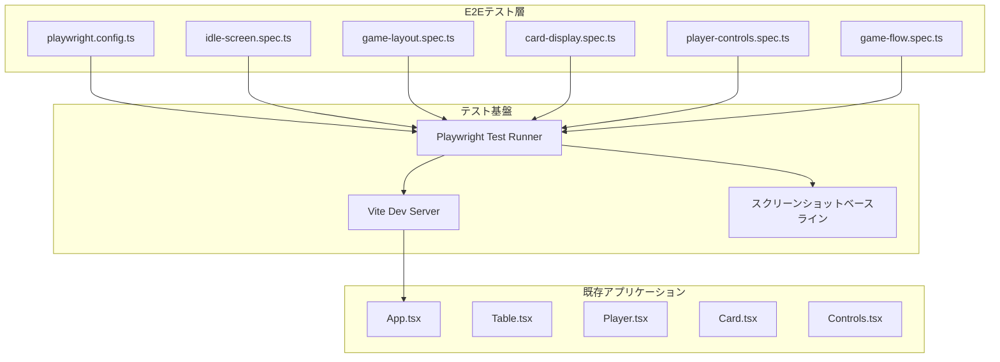
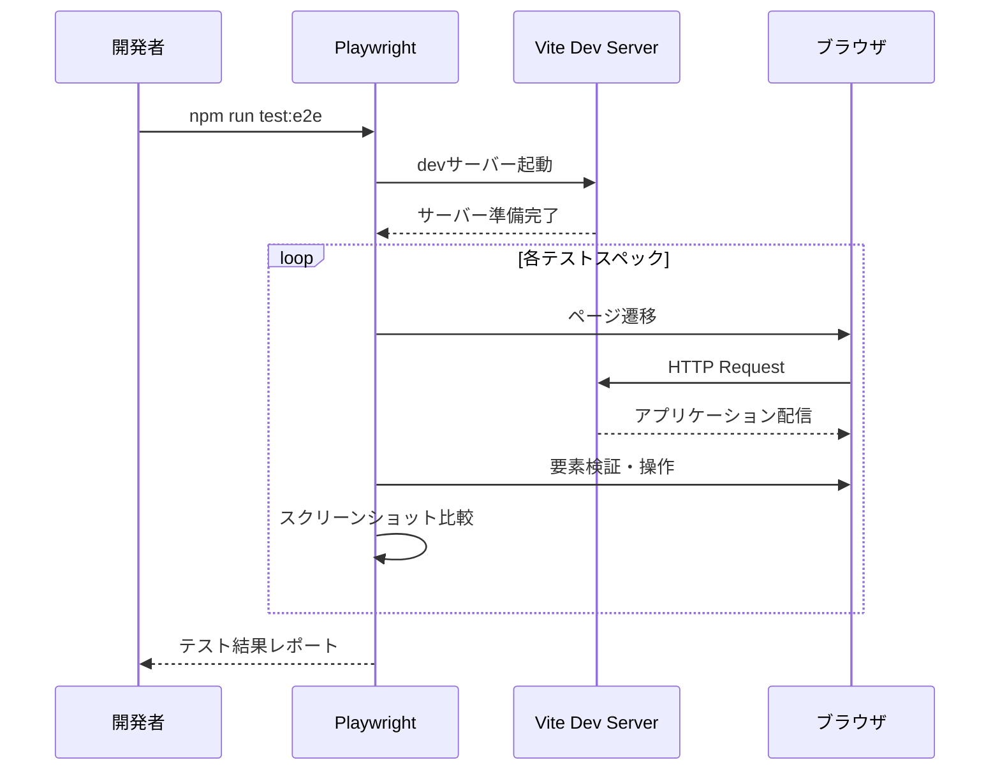
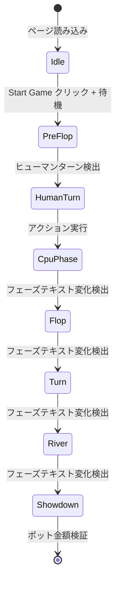

# 設計書: Playwright E2Eテスト + スクリーンショットベースライン構築

## 概要

**目的**: Playwright E2Eテスト環境を構築し、全画面状態のスクリーンショットベースラインを確立する。以降のUI変更作業でリグレッションを自動検出する基盤となる。

**ユーザー**: 開発者がUIリグレッションテストの自動実行に利用する。

**影響**: 既存コンポーネントに `data-testid` 属性を追加する。機能的な変更はない。

### ゴール
- Playwright E2Eテスト環境の構築と `npm run test:e2e` での実行
- 初期画面・ゲーム画面のスクリーンショットベースライン確立
- 要素数値検証（要素数、テキスト、BoundingBox、CSS値）によるUIテスト
- ゲームフロー全体（pre-flop → showdown）の統合テスト

### 非ゴール
- 単体テスト（Vitest）環境の構築（フェーズ1で対応）
- ゲームロジックのバグ修正（フェーズ4,5で対応）
- CI/CD環境でのテスト実行設定
- パフォーマンステスト

## アーキテクチャ

### 既存アーキテクチャ分析

既存のReact SPAアプリケーションは以下の構成:

- **UIコンポーネント層**: `App.tsx`, `Table.tsx`, `Player.tsx`, `Card.tsx`, `Controls.tsx`
- **ゲームロジック層**: `useGameEngine.ts`（カスタムフック）
- **ユーティリティ層**: `deck.ts`, `evaluator.ts`
- **テスト基盤**: 一切存在しない

既存コンポーネントに `data-testid` 属性はなく、テスト用セレクターを追加する必要がある。

### アーキテクチャパターンとバウンダリマップ



**アーキテクチャ統合**:
- 選択パターン: テスト層を既存アプリケーションから分離し、Playwrightがブラウザ経由でアプリケーションにアクセスする
- ドメイン境界: テストコードは `e2e/` ディレクトリに配置し、アプリケーションコード（`src/`）と分離
- 既存パターン保持: 既存コンポーネントの機能変更は行わない。`data-testid` 属性の追加のみ
- ステアリング準拠: プロジェクト構成のレイヤー分離方針に従う

### テクノロジースタック

| レイヤー | 選択 / バージョン | 役割 | 備考 |
|---------|-----------------|------|------|
| E2Eテスト | `@playwright/test` | ブラウザ自動化テストランナー | devDependencyとして追加 |
| 開発サーバー | Vite 8（既存） | テスト実行時のアプリケーション提供 | `playwright.config.ts` の `webServer` で自動起動 |

## システムフロー

### テスト実行フロー



### ゲームフロー統合テストの待機戦略



テストではフェーズ名テキスト（テーブル下部の `phase` 表示）の変化を `expect().toHaveText()` の `timeout` オプションで待機する。固定的な `waitForTimeout` は使用しない。

## 要件トレーサビリティ

| 要件 | 概要 | コンポーネント | インターフェース | フロー |
|------|------|--------------|----------------|--------|
| 1.1 | `@playwright/test` インストール | PlaywrightConfig | — | — |
| 1.2 | `playwright.config.ts` 作成 | PlaywrightConfig | — | テスト実行フロー |
| 1.3 | スクリーンショット閾値設定 | PlaywrightConfig | — | — |
| 1.4 | `test:e2e` スクリプト追加 | PackageScripts | — | テスト実行フロー |
| 1.5 | `test:e2e:update` スクリプト追加 | PackageScripts | — | — |
| 2.1 | タイトル文字列一致検証 | IdleScreenSpec | — | — |
| 2.2 | Start Gameボタン存在検証 | IdleScreenSpec | — | — |
| 2.3 | ボタンBoundingBox検証 | IdleScreenSpec | — | — |
| 2.4 | 初期画面スクリーンショットベースライン | IdleScreenSpec | — | — |
| 3.1 | プレイヤー情報要素数検証 | GameLayoutSpec | PlayerTestIds | — |
| 3.2 | ポット金額テキスト検証 | GameLayoutSpec | TableTestIds | — |
| 3.3 | ボタン要素数検証 | GameLayoutSpec | — | — |
| 3.4 | ロールバッジテキスト検証 | GameLayoutSpec | PlayerTestIds | — |
| 3.5 | プレイヤーBoundingBox検証 | GameLayoutSpec | PlayerTestIds | — |
| 3.6 | テーブルBoundingBox検証 | GameLayoutSpec | TableTestIds | — |
| 3.7 | ゲーム画面スクリーンショットベースライン | GameLayoutSpec | — | — |
| 4.1 | ヒューマンカードランク文字検証 | CardDisplaySpec | PlayerTestIds | — |
| 4.2 | CPUカード裏面検証 | CardDisplaySpec | PlayerTestIds | — |
| 4.3 | カードBoundingBox検証 | CardDisplaySpec | — | — |
| 5.1 | ターン中opacity検証 | PlayerControlsSpec | ControlsTestIds | — |
| 5.2 | 非ターン時opacity/pointer-events検証 | PlayerControlsSpec | ControlsTestIds | — |
| 5.3 | Fold後アクションバッジ検証 | PlayerControlsSpec | PlayerTestIds | — |
| 5.4 | Check/Callテキスト検証 | PlayerControlsSpec | — | — |
| 5.5 | Raise金額テキスト検証 | PlayerControlsSpec | — | — |
| 6.1 | pre-flopコミュニティカード0枚 | GameFlowSpec | TableTestIds | ゲームフロー統合 |
| 6.2 | flopコミュニティカード3枚 | GameFlowSpec | TableTestIds | ゲームフロー統合 |
| 6.3 | turnコミュニティカード4枚 | GameFlowSpec | TableTestIds | ゲームフロー統合 |
| 6.4 | riverコミュニティカード5枚 | GameFlowSpec | TableTestIds | ゲームフロー統合 |
| 6.5 | アクションログ要素数検証 | GameFlowSpec | AppTestIds | — |
| 6.6 | ショーダウン後ポット$0検証 | GameFlowSpec | TableTestIds | ゲームフロー統合 |

## コンポーネントとインターフェース

### コンポーネント一覧

| コンポーネント | ドメイン/レイヤー | 目的 | 要件カバレッジ | 主要依存関係 | コントラクト |
|--------------|----------------|------|--------------|-------------|-------------|
| PlaywrightConfig | テスト基盤 | Playwright設定とnpmスクリプト | 1.1〜1.5 | Vite Dev Server (P0) | — |
| TestIdAttributes | UIコンポーネント | 既存コンポーネントへのdata-testid追加 | 3.1〜6.6 | App, Table, Player, Controls (P0) | State |
| IdleScreenSpec | E2Eテスト | 初期画面のテスト | 2.1〜2.4 | PlaywrightConfig (P0) | — |
| GameLayoutSpec | E2Eテスト | ゲーム画面レイアウトのテスト | 3.1〜3.7 | PlaywrightConfig (P0), TestIdAttributes (P0) | — |
| CardDisplaySpec | E2Eテスト | カード表示のテスト | 4.1〜4.3 | PlaywrightConfig (P0), TestIdAttributes (P0) | — |
| PlayerControlsSpec | E2Eテスト | プレイヤー操作のテスト | 5.1〜5.5 | PlaywrightConfig (P0), TestIdAttributes (P0) | — |
| GameFlowSpec | E2Eテスト | ゲームフロー統合テスト | 6.1〜6.6 | PlaywrightConfig (P0), TestIdAttributes (P0) | — |

### テスト基盤

#### PlaywrightConfig

| フィールド | 詳細 |
|-----------|------|
| 目的 | Playwright E2Eテスト実行環境の設定 |
| 要件 | 1.1, 1.2, 1.3, 1.4, 1.5 |

**責務と制約**
- `@playwright/test` パッケージのインストールとPlaywright設定ファイルの管理
- Vite devサーバーの自動起動設定
- スクリーンショット比較の閾値設定
- ビューポートサイズの固定（BoundingBox検証の一貫性確保）

**依存関係**
- Outbound: Vite Dev Server — テスト実行時のアプリケーション提供 (P0)

**コントラクト**: —

##### 設定インターフェース

```typescript
// playwright.config.ts の主要設定項目
interface PlaywrightConfigSpec {
  // ビューポート: BoundingBox検証の一貫性のため固定
  viewport: { width: 1280, height: 720 };

  // スクリーンショット比較設定
  snapshotPathTemplate: '{testDir}/__screenshots__/{testFilePath}/{arg}{ext}';
  expect: {
    toHaveScreenshot: {
      maxDiffPixelRatio: number;  // 許容差分比率
    };
  };

  // devサーバー自動起動
  webServer: {
    command: 'npm run dev';
    port: number;  // Viteデフォルトポート
    reuseExistingServer: boolean;
  };
}
```

- 前提条件: Node.js環境が利用可能であること
- 事後条件: `npm run test:e2e` でPlaywrightテストが実行可能になる
- 不変条件: 既存の `npm run dev` / `npm run build` に影響を与えない

**実装ノート**
- `package.json` に `test:e2e`（`playwright test`）と `test:e2e:update`（`playwright test --update-snapshots`）スクリプトを追加する
- テストファイルは `e2e/` ディレクトリに配置する（テスト計画書の指針に従う）
- スクリーンショットベースラインは `e2e/__screenshots__/` に保存される

### UIコンポーネント（既存変更）

#### TestIdAttributes

| フィールド | 詳細 |
|-----------|------|
| 目的 | 既存コンポーネントへの `data-testid` 属性追加 |
| 要件 | 3.1〜6.6（テストセレクターとして全テストスペックが依存） |

**責務と制約**
- 既存コンポーネントの機能を一切変更しない
- `data-testid` 属性の追加のみ
- 命名規則: `{要素種類}-{識別子}` 形式

**依存関係**
- Inbound: 全テストスペック — テスト要素の特定 (P0)

**コントラクト**: State [x]

##### `data-testid` 属性定義

以下の `data-testid` 属性を既存コンポーネントに追加する:

**App.tsx**:

| 要素 | `data-testid` | 対象DOM |
|------|--------------|---------|
| ログコンテナ | `action-logs` | ログ表示の外側 `div` |

**Table.tsx**:

| 要素 | `data-testid` | 対象DOM |
|------|--------------|---------|
| テーブルコンテナ | `poker-table` | テーブルの最外側 `div` |
| ポット表示エリア | `pot-display` | "Current Pot" を含む `div` |
| コミュニティカードコンテナ | `community-cards` | カードスロット5つを含む `div` |

**Player.tsx**:

| 要素 | `data-testid` | 対象DOM |
|------|--------------|---------|
| プレイヤーコンテナ | `player-{player.id}` | プレイヤーの最外側 `div`（動的ID） |
| カードコンテナ | `player-cards-{player.id}` | カード要素を含む `div` |
| ロールバッジ | `role-badge-{player.id}` | "D"/"SB"/"BB" テキストの `div` |
| アクションバッジ | `action-badge-{player.id}` | アクション名テキストの `div` |

**Controls.tsx**:

| 要素 | `data-testid` | 対象DOM |
|------|--------------|---------|
| コントロールコンテナ | `controls` | コントロールの最外側 `div` |

**実装ノート**
- `data-testid` は本番ビルドに含まれるが、ユーザーに表示されない属性のため影響なし
- ボタン要素（Fold, Check/Call, Raise）にはテキスト/ロールベースセレクターを使用するため `data-testid` は追加しない

### E2Eテスト層

#### テストセレクター戦略（全スペック共通）

テスト内での要素選択は以下の優先順位に従う:

1. **ロールベース**: `page.getByRole('button', { name: 'Fold' })`（ボタン等のインタラクティブ要素）
2. **テキストベース**: `page.getByText('Texas Hold\'em')`（テキストコンテンツ）
3. **テストID**: `page.getByTestId('player-p1')`（構造的要素）
4. **CSS計算値**: `element.evaluate(el => getComputedStyle(el).opacity)`（スタイル検証）

#### IdleScreenSpec

| フィールド | 詳細 |
|-----------|------|
| 目的 | 初期画面（idle画面）の表示検証とスクリーンショットベースライン保存 |
| 要件 | 2.1, 2.2, 2.3, 2.4 |

**責務と制約**
- ゲーム開始前の初期画面を検証
- 静的コンテンツのため、スクリーンショット比較は安定する

**依存関係**
- External: PlaywrightConfig — テスト実行環境 (P0)

**テストケース設計**

| テストケース | 要件 | セレクター | 検証内容 |
|------------|------|-----------|---------|
| タイトル表示 | 2.1 | `page.getByRole('heading', { name: /Texas Hold'em/ })` | テキスト一致 |
| Start Gameボタン存在 | 2.2 | `page.getByRole('button', { name: 'Start Game' })` | 要素数 = 1, visible |
| ボタンBoundingBox | 2.3 | 同上 → `boundingBox()` | width > 0, height > 0, 画面内 |
| スクリーンショット | 2.4 | `page` | `toHaveScreenshot('idle-screen.png')` |

#### GameLayoutSpec

| フィールド | 詳細 |
|-----------|------|
| 目的 | ゲーム開始後の画面レイアウト検証とスクリーンショットベースライン保存 |
| 要件 | 3.1, 3.2, 3.3, 3.4, 3.5, 3.6, 3.7 |

**責務と制約**
- "Start Game" ボタンクリック後のレイアウトを検証
- CPUアクション開始前の初期レイアウト時点で検証を実行

**依存関係**
- External: PlaywrightConfig — テスト実行環境 (P0)
- Inbound: TestIdAttributes — プレイヤー/テーブル要素の特定 (P0)

**テストケース設計**

| テストケース | 要件 | セレクター | 検証内容 |
|------------|------|-----------|---------|
| プレイヤー5人表示 | 3.1 | `page.getByTestId(/^player-/)` | 要素数 = 5 |
| ポット金額テキスト | 3.2 | `page.getByTestId('pot-display')` | テキストが `$` と数値を含む |
| ボタン要素数 | 3.3 | `page.getByRole('button', { name: /Fold\|Check\|Call/ })` | Fold, Check/Call ボタンが存在 |
| ロールバッジ | 3.4 | `page.getByTestId(/^role-badge-/)` | "D", "SB", "BB" テキストが存在 |
| プレイヤーBoundingBox | 3.5 | `page.getByTestId(/^player-/)` 各要素 | 座標が画面内（0〜viewport） |
| テーブルBoundingBox | 3.6 | `page.getByTestId('poker-table')` | width, height が最低値以上 |
| スクリーンショット | 3.7 | `page` | `toHaveScreenshot('game-screen.png')` |

#### CardDisplaySpec

| フィールド | 詳細 |
|-----------|------|
| 目的 | カードの表面/裏面表示の検証 |
| 要件 | 4.1, 4.2, 4.3 |

**責務と制約**
- ヒューマンプレイヤーのカードが表面表示であること、CPUプレイヤーのカードが裏面であることを検証
- ヒューマンプレイヤーの特定: `isHuman` なプレイヤーは `name` が "You (Player)" のプレイヤー

**依存関係**
- External: PlaywrightConfig — テスト実行環境 (P0)
- Inbound: TestIdAttributes — プレイヤーカードコンテナの特定 (P0)

**テストケース設計**

| テストケース | 要件 | セレクター | 検証内容 |
|------------|------|-----------|---------|
| ヒューマンカードランク | 4.1 | ヒューマンプレイヤーの `player-cards-{id}` 内のテキスト要素 | ランク文字（2〜A）要素数 = 2 |
| CPUカード裏面 | 4.2 | CPUプレイヤーの `player-cards-{id}` 内 | ランク文字なし（裏面表示） |
| カードBoundingBox | 4.3 | カード要素の `boundingBox()` | 幅・高さが期待範囲内 |

**ヒューマンプレイヤー特定方法**: テスト内で全 `player-{id}` 要素をスキャンし、"You (Player)" テキストを含むプレイヤーをヒューマンとして特定する。

#### PlayerControlsSpec

| フィールド | 詳細 |
|-----------|------|
| 目的 | プレイヤー操作UIの状態と動作検証 |
| 要件 | 5.1, 5.2, 5.3, 5.4, 5.5 |

**責務と制約**
- ヒューマンプレイヤーのターン到達を待機してから操作検証を行う
- CPUが先にアクションする場合の待機が必要（最大数秒）

**依存関係**
- External: PlaywrightConfig — テスト実行環境 (P0)
- Inbound: TestIdAttributes — コントロール状態の特定 (P0)

**テストケース設計**

| テストケース | 要件 | セレクター | 検証内容 |
|------------|------|-----------|---------|
| ターン中opacity | 5.1 | `page.getByTestId('controls')` | CSS `opacity` ≠ 0.5 |
| 非ターン時opacity | 5.2 | `page.getByTestId('controls')` | CSS `opacity` = 0.5 または `pointer-events` = none |
| Fold後バッジ | 5.3 | Foldボタンクリック → ヒューマンの `action-badge-{id}` | テキスト = "FOLD"（uppercase） |
| Check/Callテキスト | 5.4 | `page.getByRole('button', { name: /Check\|Call/ })` | 状況に応じたテキスト |
| Raise金額テキスト | 5.5 | `page.getByRole('button', { name: /Raise/ })` | "Raise $" + 数値を含む |

**ヒューマンターン待機方法**: `page.getByTestId('controls')` の `opacity` CSS値が0.5でなくなるのを `expect` の `timeout` オプションで待機する。

#### GameFlowSpec

| フィールド | 詳細 |
|-----------|------|
| 目的 | ゲームの一連のフロー（pre-flop → showdown）の統合テスト |
| 要件 | 6.1, 6.2, 6.3, 6.4, 6.5, 6.6 |

**責務と制約**
- ゲーム全フェーズの通過を検証するため、テストのタイムアウトを十分に確保する
- 各フェーズでヒューマンプレイヤーのアクション（Callまたは Check）が必要
- CPUのランダム行動によりフェーズ進行速度が変動する

**依存関係**
- External: PlaywrightConfig — テスト実行環境 (P0)
- Inbound: TestIdAttributes — コミュニティカード・ログ・ポットの特定 (P0)

**テストケース設計**

| テストケース | 要件 | セレクター | 検証内容 |
|------------|------|-----------|---------|
| pre-flopカード0枚 | 6.1 | `page.getByTestId('community-cards')` 内のカード要素 | 表面カード数 = 0 |
| flopカード3枚 | 6.2 | 同上 | 表面カード数 = 3 |
| turnカード4枚 | 6.3 | 同上 | 表面カード数 = 4 |
| riverカード5枚 | 6.4 | 同上 | 表面カード数 = 5 |
| アクションログ | 6.5 | `page.getByTestId('action-logs')` 内の子要素 | 要素数 ≥ 1 |
| ショーダウン後ポット | 6.6 | `page.getByTestId('pot-display')` | テキストが "$0" を含む |

**フェーズ遷移の検出方法**: テーブル下部のフェーズ名テキスト変化を監視する。コミュニティカードコンテナ内の表面カード（白背景の `div`）の数をカウントしてフェーズを判定する。

**コミュニティカード枚数の検証方法**: `community-cards` コンテナ内のカードスロット5つのうち、実際にカードが描画されているスロット（`Card` コンポーネントが `faceUp={true}` で描画されたもの）の数を検証する。Table.tsxでは `communityCards[i]` が存在する場合にのみカードが描画されるため、描画済みカード要素の数で判定する。

## テスト戦略

### E2Eテスト（本設計の主対象）

| カテゴリ | テストファイル | テストケース数 | 要件 |
|---------|--------------|--------------|------|
| 初期画面 | `e2e/idle-screen.spec.ts` | 4 | 2.1〜2.4 |
| ゲームレイアウト | `e2e/game-layout.spec.ts` | 7 | 3.1〜3.7 |
| カード表示 | `e2e/card-display.spec.ts` | 3 | 4.1〜4.3 |
| プレイヤー操作 | `e2e/player-controls.spec.ts` | 5 | 5.1〜5.5 |
| ゲームフロー統合 | `e2e/game-flow.spec.ts` | 6 | 6.1〜6.6 |

### テスト実行設定

- テストタイムアウト: ゲームフロー統合テストは十分なタイムアウトを設定（フェーズ遷移にCPUアクションの完了待ちが必要なため）
- リトライ: 0回（テスト結果の信頼性確保）
- 並列実行: テストファイル間の依存関係がないため並列実行可能
- ブラウザ: Chromiumのみ（ローカル開発環境での実行を想定）

### スクリーンショットベースライン管理

- 保存先: `e2e/__screenshots__/` ディレクトリ
- 更新コマンド: `npm run test:e2e:update`

**画面ごとの安定性と閾値設定**:

| 画面 | ランダム要素 | 安定性 | `maxDiffPixelRatio` |
|------|------------|--------|-------------------|
| idle画面 | なし | 安定 | デフォルト（厳密比較） |
| ゲーム画面 | カード配布、プレイヤー配置位置 | 不安定 | 高めの閾値を設定 |

- **ゲーム画面のスクリーンショット比較の前提**: カード内容およびヒューマンプレイヤーの配置位置（`humanIndex`）がランダムに決定されるため、ゲーム画面のスクリーンショットは毎回異なる。`maxDiffPixelRatio` を適切な高めの値に設定し、カード内容やプレイヤー配置の差異を許容する前提とする。スクリーンショット比較の目的は、レイアウト構造の大幅な崩れ（要素の消失、重大な配置崩れ等）の検出であり、カード内容の一致ではない。
- **ベースライン更新の運用ルール**: 各タスクの作業が終わるたびに `npm run test:e2e:update` を実行してベースラインを更新する。UI変更を伴うタスクでは更新後のベースラインで以降の検証を行い、UI変更を伴わないタスクではスクリーンショット差分が閾値内であることを確認する。
