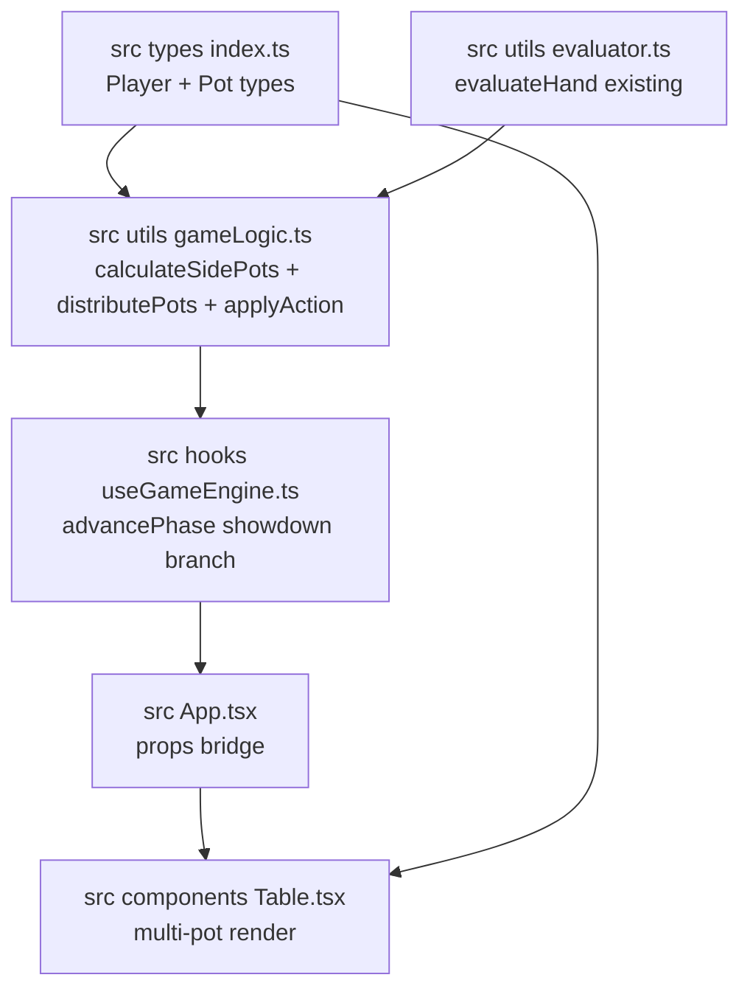
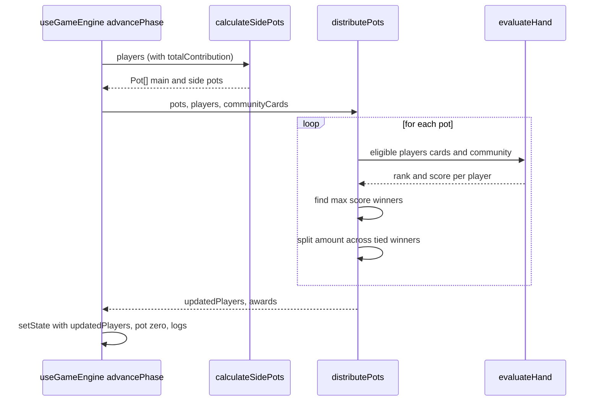
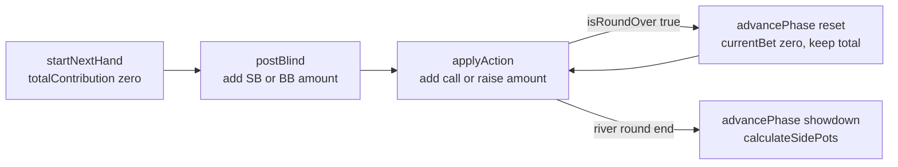

# 設計書: サイドポット実装（フェーズ6）

## Overview

**Purpose**: テキサスホールデム・ポーカーゲームに公式ルールに従ったサイドポットを実装し、調査報告書で特定された BUG-G1（サイドポットの未実装、重大度: 高）を解消する。オールインしたプレイヤーが自身の貢献額を超えるポットを獲得しないようにし、複数のポット構造をショーダウン時に正しく分配・表示する。

**Users**: プレイヤー（ヒューマン 1 名）および CPU 4 体がオールインを含むハンドを戦うすべてのケース。

**Impact**: 現在「単一ポット＋単一勝者が全額獲得」という実装を、「複数ポット＋各ポットの eligible players から勝者判定・分配」という構造に置き換える。Player 型にハンド累積投入額を追加し、ショーダウン時の分配経路を複数ポット対応に書き換え、Table コンポーネントの表示を拡張する。

### Goals

- サイドポット計算の純粋関数 `calculateSidePots(players)` を追加し、TDD で先にテスト駆動開発する
- ショーダウン時に各ポットについて eligible players から勝者を判定し、同スコアの場合は分配する
- UI に複数ポットを描画し、既存の `pot-display` testid 契約を維持する
- 既存の全ユニット・統合・E2Eテストが回帰なく通過し、スクリーンショットベースラインを更新する

### Non-Goals

- CPU AI のサイドポットを意識した戦略強化
- `evaluator.ts` のハンド評価ロジック変更
- オールイン状態専用のスクリーンショットベースライン新設（既存の `game-screen.png` のみ再ベースライン）

> `handleAction` の全員フォールド経路の分配ロジック維持、および `GameState.pot` フィールドの保持は、後述の「Boundary Commitments / Out of Boundary」で責務境界レベルの詳細とともに定義する。

---

## Boundary Commitments

> 本セクションは Non-Goals の拡張として、コンポーネント・責務レベルで「このSPECが所有するもの / 所有しないもの」を具体化する。Non-Goals が「この機能全体として着手しない範囲」を表すのに対し、ここでは個々のファイル・関数・型レベルの境界を扱う。

### This Spec Owns

- `Player` 型への `totalContribution` フィールド追加と、ブラインド・call・raise 時の累積加算
- `Pot` 型の新設（`amount`, `eligiblePlayerIds`）
- `calculateSidePots(players: Player[]): Pot[]` 純粋関数の設計・実装
- `distributePots(pots, players, communityCards): { updatedPlayers, awards }` 純粋関数の設計・実装（各ポット分配＋同スコア分配）
- `useGameEngine.advancePhase` の showdown 分岐における複数ポット分配への書き換え
- `useGameEngine.startNextHand` / `applyAction` / ブラインド投入処理における `totalContribution` 加算・リセット
- `Table.tsx` の複数ポット描画（`pot-display` コンテナ内に子要素として展開）
- 上記変更に伴うユニット・統合・E2Eテスト、およびスクリーンショットベースライン更新

### Out of Boundary

- `GameState.pot` フィールド自体の削除（データモデル上は保持し、UI の「Current Pot」表示および既存 E2E 契約（`/\$\d/` マッチ、showdown後 `$0`）との互換性維持のため残す。複数ポット詳細は `calculateSidePots(state.players)` の derived 値で表現する）
- `handleAction` 内の「1人以外全員フォールド」経路の**分配ロジック**の変更（単一ポットのまま勝者に全額加算する振る舞いは維持）
  - ただし、当該経路で state を返す直前に、全プレイヤーの `totalContribution` を 0 にリセットする 1 操作のみを追加する。既存の `newPot` 加算・`pot: 0` 設定・ログ追記等の振る舞いは一切変更しない。これは分配振る舞いの変更ではなく、UI 整合性（showdown 期間中のサイドポット描画抑制）のためのデータクリーンアップである（詳細は `useGameEngine` の Implementation Notes を参照）
- `evaluator.ts` への変更
- `advancePhase` の非showdown分岐（フェーズ遷移）のロジック変更
- テストid `pot-display` 自体のリネームや構造変更（既存E2E契約維持）
- スクリーンショットベースラインの追加（`game-screen.png` 以外）

### Allowed Dependencies

- `src/types/index.ts`（Player 型の拡張先）
- `src/utils/gameLogic.ts`（純粋関数の追加先）
- `src/utils/evaluator.ts`（読み取りのみ・`evaluateHand` の利用）
- `src/hooks/useGameEngine.ts`（showdown 分岐の書き換え）
- `src/components/Table.tsx`（UI拡張先）
- `src/App.tsx`（Table への props 橋渡し）
- React 19 / TypeScript 標準機能のみ。外部ライブラリ追加なし。

### Revalidation Triggers

以下の変更は、本仕様の整合性を再検証する必要がある：

- `Player` 型のフィールド追加・削除
- `GameState.pot` の意味論変更（合計値でなくなる等）
- `evaluateHand` の戻り値構造変更（score / rankName）
- `pot-display` testid の構造変更（親子関係、属性）
- `advancePhase` のshowdown分岐以外への副作用移動（例: showdown処理を別関数に抽出）

---

## Architecture

### Existing Architecture Analysis

- **レイヤー分離**: `types` → `utils`（純粋関数）→ `hooks`（状態管理）→ `components`（UI）の一方向依存（`structure.md` 準拠）。本設計もこの依存方向を遵守する。
- **不変性**: `applyAction` / `dealCommunityCards` は元配列を変更せず新配列を返すパターンが既存。本設計の `calculateSidePots` / `distributePots` も同パターンを踏襲。
- **状態管理**: `useGameEngine` の `useState` + 関数形式 setState。showdown 処理は現状 `advancePhase` の showdown 分岐内でインライン化されている。
- **既存分配ロジック**: showdown 分岐で `prev.pot` を `winResult.winnerId` のチップに加算する単純な1ポット分配（`useGameEngine.ts` L116-121）。
- **E2E 契約**: `TESTID_POT_DISPLAY` = `'pot-display'` が 1 コンテナ、その中に `Current Pot` ラベル + `$<数値>` 金額表示。

### Architecture Pattern & Boundary Map



**Architecture Integration**:
- 選択パターン: 既存のレイヤー分離パターン（types → utils → hooks → components）を踏襲
- ドメイン境界: `Pot` 型・計算ロジックは `gameLogic.ts`、状態更新は `useGameEngine.ts`、描画は `Table.tsx`
- 既存パターン保持: 不変性、純粋関数設計、テストid契約、相対パスインポート
- 新規コンポーネント根拠: `calculateSidePots` / `distributePots` は既存に存在しないドメインロジックで、`gameLogic.ts` に独立した純粋関数として追加
- Steering準拠: `tech.md`（React 19 + TypeScript strict + 外部ライブラリ追加なし）、`structure.md`（レイヤー分離・命名規則）

### Technology Stack

| Layer | Choice / Version | Role in Feature | Notes |
|-------|------------------|-----------------|-------|
| Frontend | React 19 | Table コンポーネント拡張 | 既存、追加ライブラリなし |
| 言語 | TypeScript strict | 型追加（Pot, totalContribution） | `any` 不使用 |
| 状態管理 | `useState` + `useGameEngine` | showdown 分岐書き換え | 既存パターン踏襲 |
| テスト | Vitest + Playwright | ユニット・統合・E2E | 既存基盤を再利用 |

---

## File Structure Plan

### Directory Structure

```
src/
├── types/
│   └── index.ts              # Player に totalContribution 追加、Pot 型新設
├── utils/
│   ├── gameLogic.ts          # calculateSidePots, distributePots, applyAction 拡張
│   ├── evaluator.ts          # 変更なし（読み取りのみ）
│   └── __tests__/
│       ├── gameLogic.sidePot.test.ts         # 新規: calculateSidePots, distributePots 単体テスト
│       ├── gameLogic.test.ts                 # 既存拡張: applyAction の totalContribution 加算検証
│       └── gameLogic.integration.test.ts     # 既存拡張: チップ保存則、分配フロー統合
├── hooks/
│   ├── useGameEngine.ts      # advancePhase showdown 分岐書き換え、postBlind に totalContribution 加算
│   └── __tests__/
│       └── useGameEngine.sidePot.test.ts     # 新規: showdown 複数ポット分配の状態遷移検証
├── components/
│   └── Table.tsx             # pots prop 受け取り、複数ポット描画
├── App.tsx                   # Table に pots prop 橋渡し
└── __tests__/
    └── helpers.ts            # createPlayer デフォルトに totalContribution: 0 追加

e2e/
├── constants.ts              # TESTID_POT_ITEM 追加
├── side-pot.spec.ts          # 新規: 複数ポット表示 E2E
└── __screenshots__/
    └── game-layout.spec.ts/game-screen.png    # 再ベースライン
```

### Modified Files

- `src/types/index.ts` — `Player.totalContribution: number` 追加、`Pot` 型新設
- `src/utils/gameLogic.ts` — `calculateSidePots` / `distributePots` 新関数追加、`applyAction` で `totalContribution` 加算
- `src/hooks/useGameEngine.ts` — `startNextHand` で `totalContribution: 0` 初期化、`postBlind` で加算、`advancePhase` の showdown 分岐を `distributePots` 呼び出しに変更
- `src/components/Table.tsx` — `pots?: Pot[]` prop 追加、複数ポット描画（`pot-display` コンテナは維持）
- `src/App.tsx` — `calculateSidePots(state.players)` を呼んで `Table` に渡す
- `src/__tests__/helpers.ts` — `createPlayer` デフォルトに `totalContribution: 0` を含める
- `e2e/constants.ts` — `TESTID_POT_ITEM` 定数追加
- `e2e/__screenshots__/game-layout.spec.ts/game-screen.png` — UIレイアウト軽微変更に伴う再ベースライン

---

## System Flows

### Showdown 時のサイドポット分配フロー



**Key Decisions**:
- `calculateSidePots` は pure で副作用なし — ハンド中の任意時点で呼び出し可能（UI描画時にも使用）
- `distributePots` もロジックを純粋関数化することで、分配の単体テストが容易になる
- 同スコアによる引き分け時は整数除算で均等分配、余りチップは tied winners のうち `players` 配列の**最小インデックス**のプレイヤーに付与（下記「同スコア分配の順序ルール」を参照）

### ハンド開始〜ショーダウンまでの totalContribution 遷移



- `currentBet` はラウンド毎にリセットされるが、`totalContribution` はハンドを通じて保持される
- `startNextHand` の次ハンド開始時に 0 へリセット

---

## Requirements Traceability

| Requirement | Summary | Components | Interfaces | Flows |
|-------------|---------|------------|------------|-------|
| 1.1 | 各プレイヤーの累積投入額からポット分割 | `calculateSidePots` | `(players) => Pot[]` | サイドポット分配フロー |
| 1.2 | 全員同額 → ポット数 1 | `calculateSidePots` | 同上 | — |
| 1.3 | 1人少額オールイン → ポット数 2 | `calculateSidePots` | 同上 | — |
| 1.4 | ポット金額計算（オールイン額×貢献者数） | `calculateSidePots` | 同上 | — |
| 1.5 | 2人異額オールイン → ポット数 3 | `calculateSidePots` | 同上 | — |
| 1.6 | 各ポットの eligible players 集合返却 | `calculateSidePots` | `Pot.eligiblePlayerIds` | — |
| 1.7 | フォールドプレイヤーの投入はポットに含め、eligible から除外 | `calculateSidePots` | 同上 | — |
| 1.8 | ポット合計 = 総投入額（チップ保存） | `calculateSidePots` | 同上 | — |
| 2.1 | 各ポット毎の勝者判定 | `distributePots` | `(pots, players, community) => {updatedPlayers, awards}` | サイドポット分配フロー |
| 2.2 | eligible players からスコア最大を勝者に | `distributePots` + `evaluateHand` | 同上 | 同上 |
| 2.3 | 勝者の chips にポット金額加算 | `distributePots` + `useGameEngine.advancePhase` | 同上 | 同上 |
| 2.4 | ショーダウン後ポット合計 0 | `useGameEngine.advancePhase` | `state.pot = 0` | — |
| 2.5 | チップ保存則 | `distributePots` | 同上 | — |
| 2.6 | 同スコア分配 | `distributePots` | 同上 | — |
| 3.1 | 各ポット 1要素以上描画 | `Table.tsx` | `props.pots: Pot[]` | — |
| 3.2 | 各ポット要素テキストに金額数値 | `Table.tsx` | 同上 | — |
| 3.3 | オールイン発生時にサイドポット追加表示 | `Table.tsx` | 同上 | — |
| 3.4 | オールインなし時は単一表示 | `Table.tsx` | 同上 | — |
| 3.5 | ショーダウン後ポット合計 0 表示 | `Table.tsx` + `useGameEngine` | 同上 | — |
| 3.6 | スクリーンショット差分 0 | 再ベースライン後の E2E | — | — |
| 4.1-4.7 | テスト・品質保証 | すべてのコンポーネント | — | — |

---

## Components and Interfaces

### サマリ表

| Component | Domain/Layer | Intent | Req Coverage | Key Dependencies | Contracts |
|-----------|--------------|--------|--------------|------------------|-----------|
| `Player` 型 | types | ハンド累積投入額を保持 | 1.1, 1.7 | — | Data |
| `Pot` 型 | types | 単一ポットの金額と eligible players | 1.1, 1.6 | — | Data |
| `calculateSidePots` | utils / pure | 累積投入額からポット配列を計算 | 1.1-1.8 | `Player`, `Pot` (P0) | Service |
| `distributePots` | utils / pure | 各ポットの勝者決定と分配 | 2.1-2.6 | `calculateSidePots` (P0), `evaluateHand` (P0) | Service |
| `applyAction`（拡張） | utils / pure | call / raise 時に `totalContribution` 加算 | 1.1 | `Player` (P0) | Service |
| `useGameEngine.advancePhase` showdown 分岐 | hooks / state | ショーダウン時に `distributePots` を呼び状態更新 | 2.1-2.5 | `distributePots` (P0) | State |
| `useGameEngine.startNextHand` / `postBlind` | hooks / state | ハンド開始時に `totalContribution` 初期化、ブラインド投入時に加算 | 1.1 | `Player` (P0) | State |
| `Table.tsx`（拡張） | components / UI | 複数ポットを `pot-display` コンテナ内に描画 | 3.1-3.5 | `Pot` (P0) | UI State |
| `App.tsx`（拡張） | components / root | `calculateSidePots` を呼び Table に渡す | 3.1-3.4 | `calculateSidePots` (P0) | — |

### types / データモデル

#### `Player`（拡張）

| Field | Detail |
|-------|--------|
| Intent | プレイヤー状態。ハンド中の累積投入チップ額を追加保持 |
| Requirements | 1.1, 1.7, 2.5 |

**Responsibilities & Constraints**
- `totalContribution: number` を追加
- 不変: `totalContribution >= 0`、ハンド開始時は 0、ブラインド・call・raise で加算、`advancePhase` のラウンド間リセットでは保持、`startNextHand` で 0 リセット

```typescript
export interface Player {
  id: string;
  name: string;
  chips: number;
  currentBet: number;        // ラウンド毎にリセット（既存）
  totalContribution: number; // 追加: ハンド中の累積投入額
  isActive: boolean;
  isHuman: boolean;
  cards: PlayingCard[];
  action: PlayerAction;
  role: 'dealer' | 'sb' | 'bb' | null;
}
```

#### `Pot`（新設）

| Field | Detail |
|-------|--------|
| Intent | メインポットまたはサイドポット 1 単位 |
| Requirements | 1.1, 1.6, 2.1 |

**Responsibilities & Constraints**
- 不変: `amount > 0`（amount = 0 のポットは生成しない）、`eligiblePlayerIds.length > 0`

```typescript
export interface Pot {
  amount: number;
  eligiblePlayerIds: string[];
}
```

配置: `src/types/index.ts` に追加（Player と同居）

### utils / ロジック

#### `calculateSidePots`（新規）

| Field | Detail |
|-------|--------|
| Intent | プレイヤーの `totalContribution` からメインポット＋サイドポット配列を計算する純粋関数 |
| Requirements | 1.1, 1.2, 1.3, 1.4, 1.5, 1.6, 1.7, 1.8 |

**Responsibilities & Constraints**
- 純粋関数（副作用なし、元配列不変）
- 入力: `Player[]`（`totalContribution` と `action` を使用）
- 出力: メインポット先頭の `Pot[]`
- チップ保存則: `sum(pots.amount) === sum(players.totalContribution)`

**Dependencies**
- Inbound: `distributePots`, `Table.tsx` 経由 `App.tsx`（P0）
- Outbound: なし
- External: なし

**Contracts**: Service [x]

##### Service Interface

```typescript
export const calculateSidePots = (players: Player[]): Pot[];
```

- Preconditions: `players` は配列。各プレイヤーの `totalContribution >= 0`
- Postconditions: 戻り値の全 `Pot.amount` の合計 = `sum(players.totalContribution)`。各 `Pot.eligiblePlayerIds` は `action !== 'fold'` のプレイヤーのみを含む
- Invariants: 元の `players` を変更しない

##### アルゴリズム概要

設計意図としては、各プレイヤーの `totalContribution` を昇順の段階（unique levels）として扱い、段階ごとに「その段階まで投入したプレイヤー数 × 段階差額」を 1 つのポットとして切り出す古典的なサイドポット構築である。フォールドしたプレイヤーは `amount` 計算には含めるが `eligiblePlayerIds` からは除外する。

**端点ケースの期待振る舞い**:
- 全員同額（100） → 1 ポット、金額 = 100 × プレイヤー数
- 1人が 50 オールイン、他 4人が 100 → 2 ポット、金額は [50×5, 50×4]
- フォールドプレイヤーの投入額は amount に含まれ、eligible には含まれない

> 詳細な擬似コードおよび実装参考は `research.md` の「9. 設計補足: `calculateSidePots` アルゴリズム擬似コード」セクションを参照する（これは**実装アルゴリズムそのものではなく、設計意図を共有するための参考記述**であり、実装時に同等の振る舞いを満たす任意のアルゴリズムで置き換え可能）。

#### `distributePots`（新規）

| Field | Detail |
|-------|--------|
| Intent | ポット配列とプレイヤー状態から各ポットの勝者を判定し分配結果を返す純粋関数 |
| Requirements | 2.1, 2.2, 2.3, 2.5, 2.6 |

**Responsibilities & Constraints**
- 純粋関数（副作用なし）
- 各ポットについて `eligiblePlayerIds` のプレイヤーの手を `evaluateHand` で評価、スコア最大プレイヤーを勝者とする
- 同スコア複数の場合は整数除算で分配、余りチップは tied winners 配列の先頭プレイヤーに付与（下記「同スコア分配の順序ルール」参照）
- 戻り値: 更新済みプレイヤー配列 + 各ポットの分配結果ログ用情報

##### 同スコア分配の順序ルール

同一ポットに対して複数プレイヤーが同スコアで並んだ場合、`distributePots` は以下の規約で分配する:

1. **tied winners の順序決定**: 当該ポットの `eligiblePlayerIds` に含まれ、かつハンドスコアが最大値と等しいプレイヤーを、関数への入力 `players: Player[]` 配列の**昇順インデックス**で並べる。これが `tiedWinners[]`（先頭が最小インデックス）。
2. **均等分配**: 各 tied winner の基本取得額 = `Math.floor(pot.amount / tiedWinners.length)`
3. **余り（remainder）配分**: `pot.amount mod tiedWinners.length` の値（0 以上 `tiedWinners.length - 1` 以下）を、`tiedWinners[0]`（= players 配列内で最小インデックスの tied winner）1 名に全額追加付与する
4. **awards 生成**: 各 tied winner ごとに `PotAward` を 1 件ずつ生成し、先頭 tied winner の `amount` のみ余りを上乗せした額、それ以外は基本取得額とする

**例**: pot.amount = 101、tied winners が players[1] と players[3]（players 配列インデックス昇順） → `tiedWinners = [players[1], players[3]]`、基本取得額 = 50、余り = 1、結果は `players[1].chips += 51, players[3].chips += 50`。

**不変条件**: `sum(awards.amount for this pot) === pot.amount`（余りを含めて完全分配され、チップが浮かない）。

**Dependencies**
- Inbound: `useGameEngine.advancePhase` showdown 分岐（P0）
- Outbound: `evaluateHand`（P0）
- External: なし

**Contracts**: Service [x]

##### Service Interface

```typescript
export interface PotAward {
  playerId: string;
  playerName: string;
  amount: number;
  handRankName: string;
}

export interface DistributePotsResult {
  updatedPlayers: Player[];
  awards: PotAward[];
}

export const distributePots = (
  pots: Pot[],
  players: Player[],
  communityCards: PlayingCard[]
): DistributePotsResult;
```

- Preconditions: `pots` は `calculateSidePots` の有効な出力。`players` は当該ハンドの全プレイヤー。`communityCards` は 5 枚（showdown 時点）
- Postconditions:
  - `sum(awards.amount) === sum(pots.amount)`
  - `sum(updatedPlayers.chips) === sum(players.chips) + sum(pots.amount)`
  - `updatedPlayers[i].totalContribution === players[i].totalContribution`（分配処理では変更しない）
- Invariants: 元の `players` / `pots` を変更しない

#### `applyAction`（拡張）

| Field | Detail |
|-------|--------|
| Intent | 既存のアクション処理に加え `totalContribution` 加算を実施 |
| Requirements | 1.1 |

**変更点**:
- `action === 'call'`: `p.totalContribution += actualCall`
- `action === 'raise'`: `p.totalContribution += raiseAmount`
- `action === 'fold'`: 変更なし
- 戻り値の `updatedPlayers` 要素に `totalContribution` が反映される

### hooks / 状態管理

#### `useGameEngine`（拡張）

| Field | Detail |
|-------|--------|
| Intent | ハンド開始時の初期化、ブラインド投入時の加算、showdown 分配の書き換え |
| Requirements | 1.1, 2.1, 2.3, 2.4 |

**Responsibilities & Constraints**
- `startNextHand` の players リセットに `totalContribution: 0` を含める
- `startGame` の `initialPlayers` に `totalContribution: 0` を含める
- `postBlind`（内部関数）: `players[idx].totalContribution += actual` を追加
- `advancePhase` の showdown 分岐（`activePlayers.length > 1` の場合）:
  - 既存の `determineWinner` + 単一分配を削除
  - `calculateSidePots(resetPlayers)` で pots を取得
  - `distributePots(pots, resetPlayers, newCommunityCards)` で分配
  - 分配後の players 全員について `totalContribution` を 0 にリセット（UI 整合性のため）
  - `updatedPlayers` で置き換え
  - `pot: 0` に設定
  - ログに `awards` を反映（勝者名・金額・役）
- `advancePhase` の非 showdown 分岐は変更なし
- `handleAction` の「1人以外全員フォールド」経路は分配ロジックを変更しないが、最終状態の書き込み時に全プレイヤーの `totalContribution` を 0 にリセットする

##### ポット分配経路での `totalContribution` リセット規約

showdown 到達経路は以下の 2 つがあり、**両経路とも分配後に全プレイヤーの `totalContribution` を 0 にリセットする**。これは `phase === 'showdown'` かつ `pot === 0` の状態で UI が `calculateSidePots` を再実行したときに、空配列が返ることを保証するための不変条件維持操作である。

| 経路 | 処理場所 | 現状 | 変更内容 |
|------|----------|------|---------|
| ショーダウン到達 | `advancePhase` の showdown 分岐 | `pot: 0` のみ | `pot: 0` + 全プレイヤーの `totalContribution: 0` |
| 全員フォールド | `handleAction` 内 `notFolded.length === 1` 分岐 | `pot: 0` のみ（単一勝者に加算済み） | `pot: 0` + 全プレイヤーの `totalContribution: 0` |

**不変条件**: `phase === 'showdown'` の期間中、`state.pot === 0 && sum(players.totalContribution) === 0` が常に成立する。

**Contracts**: State [x]

##### State Management
- state model: 既存の `GameState` + `Player.totalContribution` のみ拡張。`GameState` に新フィールドは追加しない（pots は derived として App 側で計算）
- **整合性（不変条件）**: ハンド開始時から showdown 分配直前までの全期間を通じて、`state.pot === sum(players.totalContribution)` が**常に成立する**。これは以下の 3 箇所のすべてで `pot` と各プレイヤーの `totalContribution` を同一の額だけ同時更新することで保たれる:
  1. `postBlind`: `pot += actual` と `players[idx].totalContribution += actual` を同時加算
  2. `applyAction` の `call` 分岐: `newPot += actualCall` と `p.totalContribution += actualCall` を同時加算
  3. `applyAction` の `raise` 分岐: `newPot += raiseAmount` と `p.totalContribution += raiseAmount` を同時加算
  `advancePhase` のラウンド間リセットでは `currentBet: 0` のみが行われ、`pot` と `totalContribution` はいずれもリセットされないため、不変条件が破れない。showdown 分配後は両経路で `pot: 0` と全プレイヤーの `totalContribution: 0` を同時リセットする（前述のリセット規約）。
- **テスト検証**: 要件 1.1 / 1.8 / 2.5 の検証において、この不変条件（`state.pot === sum(players.totalContribution)`）を統合テストで明示的にアサートする
- 並行性: 該当なし（SPA単一状態）

**Implementation Notes**
- Integration: `calculateSidePots` / `distributePots` は `gameLogic.ts` からインポート
- Validation: `isRoundOver` / `getNextActivePlayer` など既存関数は変更なし
- Risks:
  - `startGame` と `startNextHand` の両方で `totalContribution: 0` 初期化が必要（実装漏れに注意）
  - showdown 到達経路が 2 つある（`advancePhase` showdown 分岐 / `handleAction` 全員フォールド経路）。**両経路とも分配後に `totalContribution: 0` リセットを必須**とする（上記「ポット分配経路での `totalContribution` リセット規約」を参照）。片方のみ対応すると、全員フォールドで終局した次のレンダリングで UI に偽のサイドポットが `SHOWDOWN_DISPLAY_DELAY`（5000ms）表示され続けるリスクがある

### components / UI

#### `Table.tsx`（拡張）

| Field | Detail |
|-------|--------|
| Intent | 単一または複数のポットを `pot-display` コンテナ内に描画 |
| Requirements | 3.1, 3.2, 3.3, 3.4, 3.5 |

**変更 props**:
```typescript
interface TableProps {
  communityCards: PlayingCard[];
  pot: number;       // 既存: 合計金額（Current Pot ラベルの数値表示に使用）
  pots: Pot[];       // 追加: 複数ポット情報
  phase: string;
}
```

**描画ルール**:
- `pot-display` コンテナは維持（`data-testid="pot-display"`）
- 合計行: `Current Pot $<pot>` を従来通り表示
- `pots.length >= 2` の場合: 合計行の下に各ポット要素 `data-testid="pot-item"` を描画
  - 表示例: `Main $200 / Side $150`
  - 各要素のテキストに `$<数値>` を含める
- `pots.length <= 1` の場合: ポット項目の行は描画しない（従来通りの見た目を維持）
- `pots.length === 0`（showdown 後など）: ポット項目は描画せず、合計 `$0` のみ

**Implementation Notes**
- 既存の `toHaveScreenshot` 閾値（`maxDiffPixelRatio: 0.25`）では軽微 UI 変更は許容されるが、本仕様のサイドポット表示は視認レベルの変更となるため、**スクリーンショットベースライン `game-screen.png` の再生成（タスク 7.3）を必須**とする。再生成後のベースラインとの差分比率 0 で E2E が通過することを要件 3.6 の合格条件とする

#### `App.tsx`（拡張）

| Field | Detail |
|-------|--------|
| Intent | `calculateSidePots(state.players)` を呼び `Table` に `pots` prop として渡す |
| Requirements | 3.1-3.4 |

**変更点**:
- `import { calculateSidePots } from './utils/gameLogic';` を追加
- `<Table pot={state.pot} pots={calculateSidePots(state.players)} ... />` に変更

---

## Data Models

### Domain Model

- **集約（aggregate）**: Hand = Players + GameState。ハンド開始〜ショーダウンまでの 1 サイクル。
- **エンティティ**: Player（id をアイデンティティとする）
- **値オブジェクト**: Pot（不変、`calculateSidePots` の出力）
- **ドメインイベント**: ハンド内でフェーズ遷移・アクション・ショーダウンが発生。本仕様ではイベント駆動は使用せず、React 状態遷移のみ
- **不変条件**:
  - `sum(pots.amount) === sum(players.totalContribution)`（チップ保存: 計算側）
  - `sum(updatedPlayers.chips) === sum(players.chips) + state.pot`（チップ保存: 分配後）
  - `totalContribution >= currentBet`（累積は現ラウンドベットを含む）
  - ハンド開始時: すべての `totalContribution === 0`
  - `phase === 'showdown'` 期間中: `state.pot === 0 && sum(players.totalContribution) === 0`

> 上記のうち最後の不変条件（`phase === 'showdown'` 期間中のリセット）は、`useGameEngine` セクションの「ポット分配経路での `totalContribution` リセット規約」が両 showdown 経路で適用されることにより維持される。規約の対応表と責務割当は当該セクションを参照。本不変条件は「到達後の状態」を宣言するもので、規約の詳細をここで再掲しない。

---

## Error Handling

### Error Strategy

本仕様は純粋関数とReact状態遷移のみで構成され、外部IO・ネットワーク通信を含まない。異常系はほぼ発生しないが、以下の境界条件を明示する。

### Error Categories and Responses

| ケース | 振る舞い | 実装方針 |
|--------|---------|---------|
| `calculateSidePots(空配列)` | `[]` を返す | そのまま返却。単体テストで検証する（下記 Defensive テスト要件） |
| `calculateSidePots(全員 totalContribution === 0)` | `[]` を返す | フィルタで除外される。単体テストで検証する |
| `calculateSidePots(全員フォールド)` | amount > 0 のポットが生成されるが `eligiblePlayerIds === []` になる | この状態の出力は純粋関数として正しく返す。`distributePots` 側で eligible 0 ポットは後述のルールで skip 扱い。通常の gameplay では showdown に至らないが、純粋関数の正しさを保証する |
| `distributePots` の eligible が 0 人 | 該当ポットは awards に含めず skip し、ポット金額は浮く扱いとする | **defensive に skip 実装**を必須とする。現在の想定では `handleAction` の全員フォールド経路で showdown 到達前に終局するため gameplay 上は到達不能だが、将来の仕様変更や実装リグレッションに備えて skip 分岐を削除しない |
| `determineWinner` / `evaluateHand` の戻り値が不正 | 既存ロジックで検証済み。本仕様で追加検証なし | — |

**Defensive テスト要件**: 「到達不能」と判断したケースでも、`calculateSidePots(空配列)`、`calculateSidePots(全員 totalContribution === 0)`、および `distributePots` で全ポットの eligible が 0 人のケースは単体テストで最低限の振る舞いを検証する（戻り値が空配列 / 関数が例外を投げない）。これは要件 4.1 の網羅性に含める。

**Monitoring**: コンソールログは既存の `logs` 配列に分配結果を追記。外部監視なし。

---

## Testing Strategy

### Unit Tests

1. **`calculateSidePots` - 全員同額ベット**: `players[].totalContribution === 100`（全員）→ `result.length === 1`, `result[0].amount === 500`, `result[0].eligiblePlayerIds.length === 5` （要件 1.2, 1.6）
2. **`calculateSidePots` - 1人少額オールイン**: p0=50（all-in）、p1..p4=100 → `result.length === 2`, `result[0].amount === 250`, `result[1].amount === 200`, `result[1].eligiblePlayerIds` に p0 を含まない（要件 1.3, 1.4, 1.6）
3. **`calculateSidePots` - 2人異額オールイン**: p0=30（all-in）, p1=70（all-in）, p2..p4=100 → `result.length === 3`, amounts = [150, 160, 90], eligible counts = [5, 4, 3]（要件 1.5, 1.6）
4. **`calculateSidePots` - フォールドプレイヤーの貢献はポットに含み eligible から除外**: p0=50（fold）、p1..p4=100 → pot.amount にp0の50を含み、eligibleに p0 を含まない（要件 1.7）
5. **`calculateSidePots` - チップ保存則**: `sum(result.amount) === sum(players.totalContribution)`（要件 1.8）
6. **`calculateSidePots` - 不変性**: 元の `players` 配列が変更されないこと
7. **`distributePots` - 単一ポット分配**: 1 ポット、1 勝者 → `winner.chips += pot.amount`, `sum(chips) 保存`（要件 2.3, 2.5）
8. **`distributePots` - 複数ポット分配**: オールインケースで勝者が各ポットで異なる → `awards.length === pots.length`, チップ増加額が各 award の和と一致（要件 2.1, 2.3, 要件 4.3）
9. **`distributePots` - 同スコア分配（均等割り切れるケース）**: 2 プレイヤーが同スコアでタイ、pot.amount = 100 → 各 50 ずつ、`sum(awards.amount) === 100`（要件 2.6）
10. **`distributePots` - 同スコア分配（余りありケース）**: `players[1]` と `players[3]` が同スコアでタイ、pot.amount = 101 → `tiedWinners = [players[1], players[3]]`、`players[1]` に 51、`players[3]` に 50 付与（players 配列最小インデックスに余り 1 付与、要件 2.6）
11. **`distributePots` - 同スコア 3 人ケース**: `players[0], players[2], players[4]` が同スコアでタイ、pot.amount = 100 → 各 33、余り 1 が `players[0]` に付与され `players[0]` が 34 を受け取る（要件 2.6）
12. **`distributePots` - 不変性**: 元の `players` / `pots` が変更されないこと
13. **`distributePots` - 全ポット eligible 0人ケース（defensive）**: 全ポットの `eligiblePlayerIds === []` 時、関数が例外を投げず `awards === []` を返す（要件 4.1、defensive テスト要件）
14. **`calculateSidePots` - 空配列入力（defensive）**: `calculateSidePots([])` が `[]` を返す（要件 4.1、defensive テスト要件）
15. **`calculateSidePots` - 全員 totalContribution === 0（defensive）**: 全プレイヤーの `totalContribution === 0` の入力で `[]` を返す（要件 4.1、defensive テスト要件）
16. **`applyAction` - call で totalContribution 加算**: call 額が加算されること
17. **`applyAction` - raise で totalContribution 加算**: raise 額が加算されること
18. **`applyAction` - fold で totalContribution 変更なし**: fold 時は加算しない

### Integration Tests

1. **統合: `postBlind` + `applyAction` + `calculateSidePots`**: ブラインド投入→call→raise→オールインの一連フローで `totalContribution` が正しく累積され、最終的なサイドポットが期待通り計算される（要件 1.1, 1.8）
2. **統合: 複数ラウンドにわたる `totalContribution` 保持**: pre-flop でベット → `advancePhase` → flop でさらにベット → `totalContribution` が合算されていること（要件 1.1）
3. **統合: ショーダウン分配フロー**: 3人プレイヤーのオールインケースで `calculateSidePots` → `distributePots` までの一連の流れで、勝者 chips 増加額 = 各ポットの合算と一致（要件 2.3, 4.3）
4. **統合: チップ保存則（ハンド全体）**: ハンド開始前の全プレイヤー chips 合計 = ショーダウン後の全プレイヤー chips 合計（要件 2.5）
5. **統合: showdown 両経路での `totalContribution` 0 リセット**: (a) `advancePhase` showdown 分岐到達後、および (b) `handleAction` 全員フォールド分岐到達後のいずれでも、`state.phase === 'showdown'` 時点で全プレイヤーの `totalContribution === 0` かつ `state.pot === 0` であること（要件 3.5）
6. **統合: pot / totalContribution 同期不変条件**: ハンド開始時から showdown 分配直前までの全タイミングで、`state.pot === sum(players.totalContribution)` が成立することを、ブラインド投入・call・raise 後の複数時点で数値検証（要件 1.1, 1.8, 2.5）

### E2E / UI Tests

1. **E2E: `pot-display` 単一要素の維持**: `page.getByTestId('pot-display')` の要素数 = 1（既存契約維持、`test-id-attributes.spec.ts` の既存テストが引き続き通ること）
2. **E2E: オールインなしの単一ポット表示**: 通常進行時、`pot-display` 内のポット項目数が 1 以下（要件 3.4）
3. **E2E: ポット表示テキストに `$<数値>`**: `pot-display` 全体のテキストが `/\$\d/` にマッチ（既存 `game-layout.spec.ts` の契約維持、要件 3.2）
4. **E2E: ショーダウン後ポット合計 `$0`**: 既存 `game-flow.spec.ts` が引き続き通る（要件 2.4, 3.5）
5. **E2E: スクリーンショット再ベースライン**: `game-screen.png` を更新後、差分 0 で通過（要件 3.6）

### パフォーマンス・ロード

- 本仕様はクライアントサイド SPA で計算量は O(N^2) 以下（Nは5人）。パフォーマンス目標設定は不要。

---

## Supporting References

- 調査報告書: `.kiro/specs/validate-game/investigation-report.md`（BUG-G1）
- 作業計画書: `.kiro/specs/validate-game/work-plan.md`（フェーズ6）
- テスト計画書: `.kiro/specs/validate-game/test-plan.md`
- 本仕様の discovery / synthesis ノート: `.kiro/specs/side-pot-implementation/research.md`
