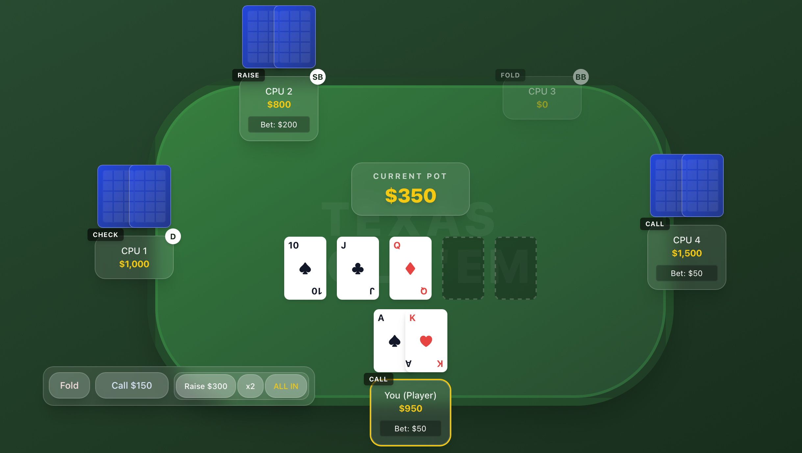

# Texas Hold'em Web App


ブラウザ上で動作する「テキサスホールデム」のWebアプリケーションです。
Apple公式アプリのような「リッチな質感」と「滑らかなアニメーション」を備えたダークモード＆すりガラス調（Glassmorphism）のモダンなUIを採用しています。

## 概要
- **プレイヤー**: 人間 1人 vs CPU 4人
- **ルール**: 初期チップ1000枚。DBを使わずブラウザ上で完結（リロードでリセット）。
- **AI**: ランダム確率に基づく自動アクション（チェック、コール、レイズ、フォールド）。
- **役判定**: 7枚のカードから最も強い5枚を自動で算出し、厳密にスコア付けして勝敗を決定します。
- **サイドポット**: オールイン発生時にメインポット・サイドポットが自動生成され、各ポットで独立に勝者判定・チップ分配が行われます。

## 技術スタック
- **Vite**
- **React 19**
- **TypeScript**
- **Tailwind CSS v4**

## ローカル開発環境の立ち上げ
```bash
npm install
npm run dev
```

ターミナルで起動後、ブラウザで `http://localhost:5173` にアクセスして「Start Game」からプレイを開始してください。
